# Demand Execution

**What it is:** the workflow infrastructure that takes a declarative description of a containerized
scientific job — an image, a command, and named parameters that point at S3 — and makes it run:
staging inputs onto a shared filesystem, sizing and submitting the job on AWS Batch, shipping
outputs back to S3, and reclaiming the scratch space afterward.

**Status:** reference documentation. Describes the system **as deployed today**, not as proposed.
**Last verified against code:** 2026-08-09 (see [Appendix D](#appendix-d-verification-inference-and-gaps)).

> **Not in `mkdocs.yml` nav, deliberately.** This repo's docs site is published publicly to
> <https://alleninstitute.github.io/aibs-informatics-cdk-lib/>. This document names latent bugs, a
> data-loss hazard, `privileged=True` on science containers, and internal ticket IDs — appropriate
> for engineers reading the repo, not for an indexed public site. Keep it out of `nav` unless
> someone decides otherwise deliberately.

---

## The 60-second version

A caller submits JSON: a container image, a command like `run.sh --in ${INPUT_BAM}`, and params
where `input-bam` is an S3 URI. The system:

1. **Scaffolds** — resolves EFS mounts, rewrites every S3 URI into a concrete container path,
   decides what to copy in, what to copy out, and what to delete.
2. **Stages in** — copies each input from S3 onto EFS, in parallel with registering the job
   definition.
3. **Runs** — submits one AWS Batch job. The container sees `INPUT_BAM=/opt/scratch/exec-123/…`
   and a real file at that path. It never talks to S3.
4. **Stages out** — copies each output from EFS to S3.
5. **Cleans up** — deletes the inputs and the working directory. A daily sweep catches whatever
   leaked.

Steps 1, 2, 4, and 5 are themselves AWS Batch jobs, not Lambda functions — that single fact
explains most of the system's shape ([§1.5](#15-the-one-fact-that-explains-the-shape)).

---

## How to read this document

This is written for engineers and for product managers comfortable with AWS primitives. It is
long, but it is layered — you are not expected to read it front to back.

| If you are… | Read | Roughly |
|---|---|---|
| **New here**, and want to know what this thing does | [Part I](#part-i-orientation) | 10 min |
| **Writing a caller** — submitting demand executions from another service | [Part I](#part-i-orientation), [§2](#2-the-object-model), [§4](#4-the-life-of-one-execution), [Appendix B](#appendix-b-configuration-defaults) | 25 min |
| **On call**, staring at a failed execution | [§5.5](#55-why-the-console-graph-is-bigger-than-the-diagram) (why the console looks like that), [§12](#12-failure-retry-and-observability), [§11](#11-cleanup-two-separate-mechanisms) | 15 min |
| **About to change something** | [Part III](#part-iii-mechanics) for the subsystem you're touching, then [§16](#16-extension-points) and [§15](#15-sharp-edges-warts-and-latent-bugs) | as needed |
| **Asking "why is it like this?"** — design review, or you inherited it | [Part I](#part-i-orientation), then [Part IV](#part-iv-why-it-looks-like-this) | 30 min |
| **Looking up one specific thing** | [Appendix A](#appendix-a-glossary) (terms), [Appendix B](#appendix-b-configuration-defaults) (defaults), [Appendix C](#appendix-c-component-inventory) (where code lives) | — |

### Contents

**Part I — Orientation**
[1. What a demand execution is](#1-what-a-demand-execution-is)

**Part II — The mental model**
[2. The object model](#2-the-object-model) ·
[3. The three coordinate systems](#3-the-three-coordinate-systems) ·
[4. The life of one execution](#4-the-life-of-one-execution)

**Part III — Mechanics**
[5. The execution graph](#5-the-execution-graph) ·
[6. `batch-invoked-lambda` in detail](#6-batch-invoked-lambda-in-detail) ·
[7. The handlers](#7-the-handlers) ·
[8. Paths, parameters, and the container environment](#8-paths-parameters-and-the-container-environment) ·
[9. Storage and mounts](#9-storage-and-mounts) ·
[10. Data sync](#10-data-sync) ·
[11. Cleanup](#11-cleanup-two-separate-mechanisms) ·
[12. Failure, retry, and observability](#12-failure-retry-and-observability) ·
[13. The infrastructure](#13-the-infrastructure)

**Part IV — Why it looks like this**
[14. Design decisions](#14-design-decisions) ·
[15. Sharp edges, warts, and latent bugs](#15-sharp-edges-warts-and-latent-bugs) ·
[16. Extension points](#16-extension-points) ·
[17. Pressure on the system, and in-flight work](#17-pressure-on-the-system-and-in-flight-work)

**Appendices**
[A. Glossary](#appendix-a-glossary) ·
[B. Configuration defaults](#appendix-b-configuration-defaults) ·
[C. Component inventory](#appendix-c-component-inventory) ·
[D. Verification, inference, and gaps](#appendix-d-verification-inference-and-gaps)

### Where the code lives, and how it's cited

The system spans four repositories. **This document lives in `cdk-lib`**, the one at the top of the
dependency stack — its app builds the `aws-lambda` Docker image from that repo's `main` at synth
time, so it is the only one of the four that can reference all of them without inverting the
dependency.

| Key | Repo | Role |
|---|---|---|
| `core` | `aibs-informatics-core` | Pure models and utilities. No AWS calls. |
| `aws-utils` | `aibs-informatics-aws-utils` | AWS primitives: S3 transfer, EFS path translation, Batch job construction. |
| `lambda` | `aibs-informatics-aws-lambda` | The handlers. Despite the name, these run as **Batch jobs**. |
| `cdk` | **`aibs-informatics-cdk-lib` — this repo** | Infrastructure and orchestration: Step Functions topology, EFS, Batch, and the reference app. |

Citations are `key:path/from/src-root.py:line`. So `core:models/demand_execution/model.py:17`
means `aibs-informatics-core/src/aibs_informatics_core/models/demand_execution/model.py`, line 17;
a `cdk:` citation resolves against this repo's own `src/`.

Roughly a third of what this document explains is `lambda` code — the scaffolding handler, the
context manager, the data sync handlers. Those files are documented from here because this is where
they are *wired together*; the handler repo carries a pointer at
`docs/developer/demand-execution.md`.

Claims that were **inferred** rather than read directly are marked **(inferred)**. Things that
could not be determined are collected in [Appendix D](#appendix-d-verification-inference-and-gaps)
rather than guessed at.

---

# Part I: Orientation

## 1. What a demand execution is

### 1.1 The problem

A **demand execution** is one scientific workload run on demand — "demand" as in ad-hoc, as
opposed to a scheduled pipeline. It is described declaratively by a `DemandExecution`
(`core:models/demand_execution/model.py:17`): a container image, a command, typed parameters,
resource requirements, and a target execution platform.

The domain problem is blunt: **genomics tooling reads and writes ordinary files, but the data
lives in S3.** A caller submits `s3://bucket/sample.bam` and a command like
`run.sh --in ${INPUT_BAM}`. The container needs to see `INPUT_BAM=/opt/scratch/exec-123/tmp96b35153`
and a real file at that path. Getting the bytes there, telling the container where they are, and
cleaning up afterward is the system's job — not the science tool's.

AWS Batch containers can mount EFS. So every run is bracketed by a **stage-in** and a
**stage-out**, and needs scratch space on a shared filesystem. Everything else is machinery
around that.

The second structural driver is **cost separation**. Staging a terabyte out of S3 is I/O-bound and
wants cheap, small instances. The science job is CPU/GPU-bound and wants expensive ones. Running
them as separate Batch jobs against shared EFS lets each phase size its own compute. This is why
the system is a workflow rather than one container that does its own downloads.

### 1.2 The contract with the container

Everything the system does exists to deliver this contract. A demand execution container can rely
on:

- Every input parameter is an **environment variable holding an absolute local path**, and a real
  file or directory exists at that path before the command starts.
- Every output parameter is an environment variable holding an absolute local path **inside a
  writable directory**; anything written there is uploaded to S3 after the command exits `0`.
- `$WORKING_DIR` exists, is writable, and is the process's cwd.
- `$TMPDIR` exists and is writable.
- `$EXECUTION_ID` identifies the run.
- Non-path params are plain environment variables, with `${...}` cross-references already resolved.

The container needs no AWS credentials, no S3 client, and no knowledge of EFS.

### 1.3 A worked example

The clearest way to understand the system is to follow one parameter all the way through.

**The caller submits:**

```jsonc
{
  "execution_type": "demo",
  "execution_id": "exec-123",
  "execution_image": "acct.dkr.ecr.us-west-2.amazonaws.com/demo:1",
  "execution_parameters": {
    "command": ["run.sh", "--in", "${INPUT_BAM}", "--out", "${OUT_DIR}"],
    "params": {
      "input-bam": "s3://bucket/prefix/sample.bam",
      "out_dir":   "results/",
      "threads":   8,
      "derived":   "${THREADS}-way"
    },
    "inputs":  ["input-bam"],
    "outputs": ["out_dir"],
    "output_s3_prefix": "s3://out-bucket/run1"
  }
}
```

**Step 1 — name normalization.** `JobParamEnvName` (`core:models/demand_execution/job_param.py:11`)
uppercases and replaces `-` and `.` with `_`. So `input-bam` → `INPUT_BAM`, `out_dir` → `OUT_DIR`.
This is what makes `${INPUT_BAM}` in the command resolve to the `input-bam` param.

**Step 2 — classification.** `inputs` and `outputs` are *lists of keys into `params`*. A key listed
in `inputs` has its value interpreted as a downloadable resolvable; a key in `outputs` as an
uploadable; everything else is stringified as-is (`core:models/demand_execution/parameters.py:313-356`).

| Param | Class | `value` (local) | `remote_value` |
|---|---|---|---|
| `input-bam` | `DownloadableJobParam` | `tmp96b35153` | `s3://bucket/prefix/sample.bam` |
| `out_dir` | `UploadableJobParam` | `results/` | `s3://out-bucket/run1/results/` |
| `threads` | `JobParam` | `"8"` | — |
| `derived` | `JobParam` | `"${THREADS}-way"` | — |

The input's default local name `tmp96b35153` is `f"tmp{sha256_hexdigest(remote)[:8]}"`
(`core:models/demand_execution/resolvables.py:94`). The output's remote is synthesized from
`output_s3_prefix` because the caller gave a bare relative path (`parameters.py:344-354`). A caller
can override either side with the `" @ "` string form: `"s3://bucket/x @ myname"` for an input,
`"myname @ s3://bucket/x"` for an output (`resolvables.py:42-108`).

**Step 3 — reference resolution.** `JobParamResolver.resolve_references`
(`core:models/demand_execution/job_param_resolver.py:30`) topologically resolves `${...}` between
params, so `derived` becomes `8-way`. Cycles, self-references, and dangling references all raise
`ValidationError` (`job_param_resolver.py:94-100`).

**Step 4 — path rewriting.** `DemandExecutionContextManager.__post_init__`
(`lambda:handlers/demand/context_manager.py:187-203`) rewrites every input and output to an
absolute container path. With defaults (`isolate_inputs=True`):

| Param | local path after rewrite |
|---|---|
| `input-bam` | `/opt/scratch/exec-123/tmp96b35153` |
| `out_dir` | `/opt/scratch/exec-123/results` |

With `isolate_inputs=False`, the input instead lands in the content-keyed shared cache at
`/opt/shared/96b3515358b1…cb73` — the **full** sha256 of the remote value
(`context_manager.py:525`). See [§8.2](#82-inputs-and-isolate_inputs).

**Step 5 — environment.** `generate_batch_job_builder` (`context_manager.py:681-689`) seeds:

```
EXECUTION_ID = exec-123
WORKING_DIR  = /opt/scratch/exec-123
TMPDIR       = /opt/scratch/tmp
```

then calls `JobParam.update_environment` for every param, producing:

```
INPUT_BAM = /opt/scratch/exec-123/tmp96b35153
OUT_DIR   = /opt/scratch/exec-123/results
THREADS   = 8
DERIVED   = 8-way
```

**Step 6 — command assembly.** Pre-commands are prepended and the whole thing becomes one
`bash -c` string (`context_manager.py:692-696`, `:792`, wrapped at `:810`):

```bash
mkdir -p ${WORKING_DIR} && mkdir -p ${TMPDIR} && cd ${WORKING_DIR} \
  && . ${_ENVIRONMENT_FILE} \
  && run.sh --in ${INPUT_BAM} --out ${OUT_DIR}
```

Note the command keeps its `${...}` references — the **shell** resolves them at container runtime
from the environment, not the builder at build time. (`resolved_command` on
`DemandExecutionParameters` does eager substitution, but the job builder does not use it; it
deep-copies the raw `command` at `context_manager.py:700`.)

**Step 7 — env file offload.** Variables *not* referenced in the command are moved out of the Batch
container overrides into a `.demand.env` file on EFS, sourced by the `. ${_ENVIRONMENT_FILE}`
pre-command. See [§8.5](#85-the-demandenv-offload).

### 1.4 The moving parts: four state machines

There are four Step Functions state machines in the stack. **Only one is the demand execution
itself**; the other three are reusable services it calls.

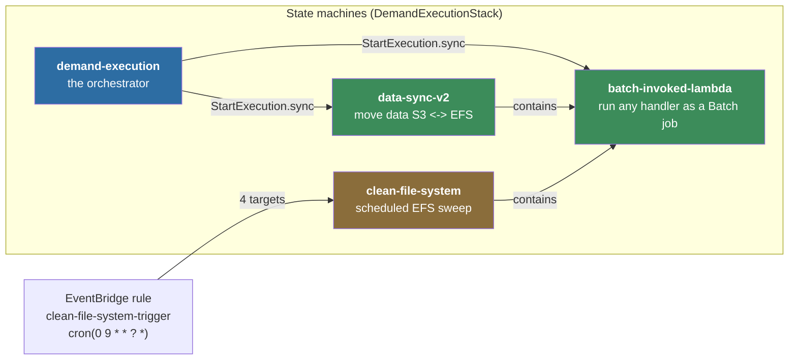

All four are created in `DemandExecutionStack` (`cdk:aibs_informatics_core_app/stacks/demand_execution.py:79`):

| State machine | Built from | Line |
|---|---|---|
| `batch-invoked-lambda` | `BatchInvokedLambdaFunction.with_defaults` | `stacks/demand_execution.py:125-136` |
| `data-sync-v2` | `DataSyncFragment` | `stacks/demand_execution.py:138-148` |
| `demand-execution` | `DemandExecutionFragment` | `stacks/demand_execution.py:150-167` |
| `clean-file-system` | `CleanFileSystemFragment` | `stacks/demand_execution.py:171-180` |

### 1.5 The one fact that explains the shape

> **The handlers in `aibs-informatics-aws-lambda` do not run as Lambda functions. They run as AWS
> Batch jobs.**

A Step Functions fragment — `BatchInvokedLambdaFunction`
(`cdk:constructs_/sfn/fragments/informatics/batch.py:55`) — writes a handler's JSON request to an
S3 scaffolding bucket, submits a Batch job whose container is told *which handler to import* and
*where its payload lives*, then reads the response back out of S3. Throughout this document, a step
marked **⟨BIL⟩** is one hop through this machinery, and costs one AWS Batch job.

Three reasons, all load-bearing:

1. **Lambda mounts exactly one EFS file system.** The system needs shared and scratch mounted
   simultaneously — and infrastructure jobs need the root mount to see the whole filesystem.
2. **Lambda's 15-minute / 10 GB ceiling.** Staging hundreds of gigabytes does not fit.
3. **Cost separation** (see [§1.1](#11-the-problem)). Transfer handlers run on small
   `demand-infra-lambda*` Batch environments; the science job runs on whatever queue the caller
   asks for.

This is expanded as a design decision in [§14, D1](#14-design-decisions), and the mechanism is
detailed in [§6](#6-batch-invoked-lambda-in-detail).

### 1.6 What one execution costs, in jobs

```
total Batch jobs = 2 + I + 1 + O + C
                   │   │   │   │   └── cleanup: 0, 1, or 2 (cleanup_inputs, cleanup_working_dir)
                   │   │   │   └────── one data-sync job per output parameter
                   │   │   └────────── the science job
                   │   └────────────── one data-sync job per input parameter
                   └────────────────── scaffolding + create-job-definition
```

A typical execution with 3 inputs and 2 outputs runs **9 infrastructure jobs around 1 science job**.

Each ⟨BIL⟩ invocation additionally **registers a fresh Batch job definition, submits against it, and
deregisters it** (`cdk:constructs_/sfn/fragments/batch.py:129`) — so Batch API traffic is several
times the job count. See [§14, D4](#14-design-decisions).

### 1.7 Ten words you need right now

Full definitions in [Appendix A](#appendix-a-glossary).

| Term | Short form |
|---|---|
| **Scaffolding** | The prep phase: resolve mounts, rewrite paths, emit every downstream request. |
| **⟨BIL⟩ / batch-invoked lambda** | A handler run as a Batch job, request/response via S3. |
| **Volume role** | A logical storage area — `shared`, `scratch`, `tmp` — decoupled from the filesystem backing it. |
| **Access point** | An EFS feature pinning a mount to a subdirectory and POSIX identity. |
| **Working directory** | `{scratch}/{execution_id}` — this run's scratch space; `$WORKING_DIR`. |
| **Resolvable** | A param with both a `local` and a `remote` value. Inputs localize; outputs delocalize. |
| **Job param** | The flattened, environment-variable form of a param. |
| **Enclosure** | A one-branch `Parallel` used to scope JSON paths around a chain. Why the console graph is huge. |
| **Env base** | The stage prefix (`dev`, `prod`) threaded through resource names and used as a runtime tag filter. |
| **Sweep / janitor** | The daily EventBridge-triggered EFS cleanup, independent of any execution. |

---

# Part II: The mental model

## 2. The object model

### 2.1 Domain models

All models are Pydantic v2 (`PydanticBaseModel`, `core:models/base/_pydantic_model.py:20`) with
`extra="ignore"` and camelCase alias generation. **That `extra="ignore"` is load-bearing and bites
later** — see [§10.5](#105-the-distributed-path-that-isnt-wired-in) and [§15](#15-sharp-edges-warts-and-latent-bugs).

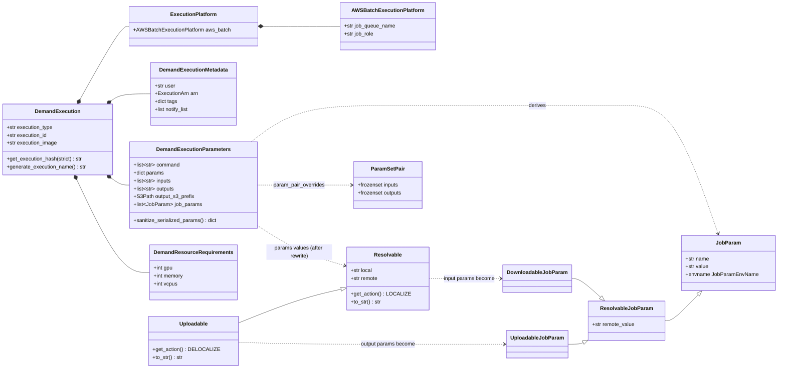

Definitions: `DemandExecution` `core:models/demand_execution/model.py:17`;
`DemandExecutionParameters` `parameters.py:58`; `DemandExecutionMetadata` `metadata.py:11`;
`ExecutionPlatform` `platform.py:11`; `DemandResourceRequirements` `resource_requirements.py:8`;
`Resolvable`/`Uploadable` `resolvables.py:255,263`; `JobParam` family `job_param.py:58,116,137,143`;
`ParamPair`/`ParamSetPair` `param_pair.py:14,60` — all under `core:models/demand_execution/`.

### 2.2 The `params`, `inputs`, `outputs` split

`params` is a flat `dict[str, JsonValue | BaseModel]`. `inputs` and `outputs` are **lists of keys
into `params`** — they carry no values of their own. Validation enforces that every key named in
`inputs`/`outputs` exists in `params`, and that their derived env names do not collide
(`parameters.py:97-114`).

`Resolvable.to_str()` and `Uploadable.to_str()` return *different* string shapes —
`"{remote} @ {local}"` and `"{local} @ {remote}"` — because they carry opposite `ResolvableAction`
values (`resolvables.py:188-196`). This asymmetry matters; see [§15](#15-sharp-edges-warts-and-latent-bugs).

`ParamSetPair` (`param_pair.py:60`) expresses which inputs feed which outputs. It is validated
(`parameters.py:116-138`) and exposed via `param_set_pairs` / `job_param_set_pairs`, but **nothing
in the pipeline consumes it** — the scaffolding handler iterates inputs and outputs flatly. It is
model surface awaiting a consumer.

### 2.3 Data sync models

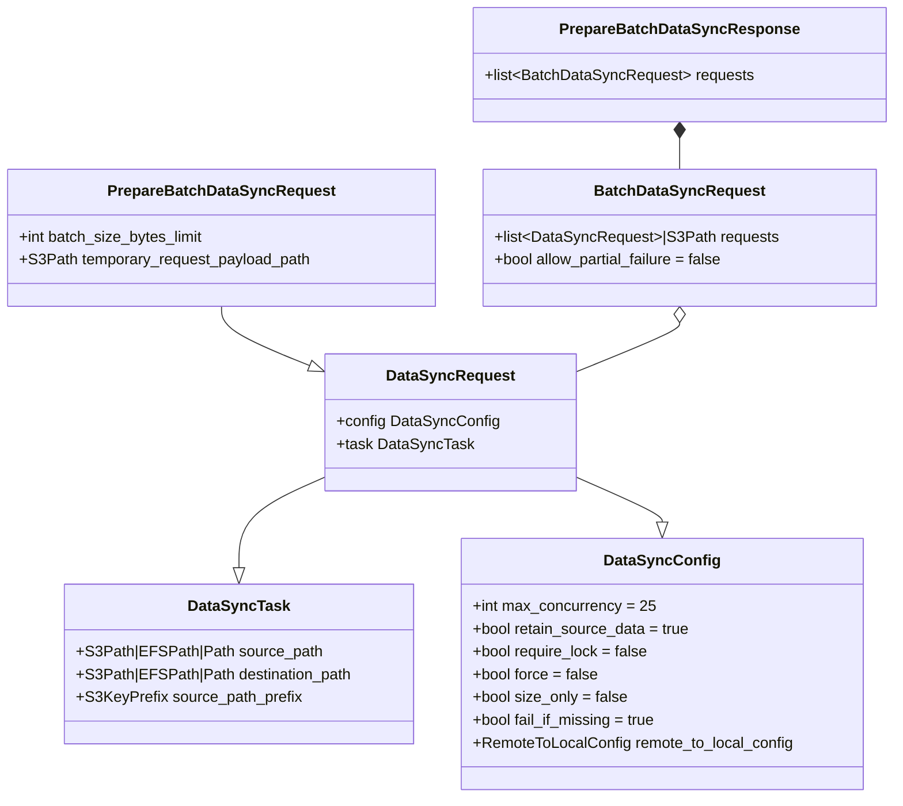

Lines in `core:models/data_sync.py`: `DataSyncTask:64`, `DataSyncConfig:82`, `DataSyncRequest:95`,
`BatchDataSyncRequest:144`, `PrepareBatchDataSyncRequest:193`, `PrepareBatchDataSyncResponse:200`.

`DataSyncRequest` is a diamond of `DataSyncTask` (what to move) and `DataSyncConfig` (how), with
`.task` and `.config` properties to split it apart again (`data_sync.py:98-119`).

`BatchDataSyncRequest.requests` is `list[DataSyncRequest] | S3Path` — the `S3Path` variant is the
escape hatch for Step Functions' 256 KB state limit. `PrepareBatchDataSyncHandler`, given a
`temporary_request_payload_path`, uploads each batch's request list to S3 and returns the URI
(`lambda:handlers/data_sync/operations.py:300-314`); `BatchDataSyncHandler` re-downloads it
(`operations.py:193-197`).

> **Two different config classes share a similar name.** `core:models/data_sync.py:DataSyncConfig`
> is the wire model, with `size_only=False`. `lambda:handlers/demand/model.py:65:DataSyncConfiguration`
> is the *demand-path* config, with `size_only=True` (`model.py:81`). The demand path passes only
> `size_only`, `force`, and an optional `temporary_request_payload_path` from the latter; it
> hardcodes `retain_source_data`, `require_lock`, and `batch_size_bytes_limit` at the call site
> (`context_manager.py:352-365`, `:392-402`), and never sets `max_concurrency`, so that takes the
> core default of 25. When reasoning about sync behavior, **the demand-path values are the ones
> that apply** — see [Appendix B](#appendix-b-configuration-defaults).

## 3. The three coordinate systems

A single location is expressed three ways, and the code converts between them constantly. Holding
these apart is most of what it takes to read a log line correctly.

| Form | Example | Meaning |
|---|---|---|
| **Container path** | `/opt/scratch/exec-123/X` | Where a process sees it, given *its own* mounts |
| **EFS URI** | `fs-0abc123:/scratch/exec-123/X` | Global, host-independent location on the filesystem |
| **S3 URI** | `s3://bucket/prefix/A` | The remote of record |

The same byte on EFS has a *different container path* depending on which job is looking at it: the
science container sees `/opt/scratch/exec-123/X`, while an infrastructure job mounting the root
access point sees `/opt/efs/scratch/exec-123/X`. **The EFS URI is the only form that is stable
across jobs**, which is why every request that crosses a job boundary carries EFS URIs, not paths.

Conversion is done by `MountPointConfiguration` (`aws-utils:efs/mount_point.py:52`):

- `as_mounted_path()` (`:206`) — EFS/relative → container path
- `as_efs_path()` / `as_efs_uri()` (`:168`, `:191`) — container/relative → EFS
- module helpers `get_efs_path()` and `get_local_path()` (`aws-utils:efs/paths.py:53`, `:105`)
  search a list of mount points and raise if unresolvable

Note the EFS URI serializes **without** an `efs://` scheme — `fs-0abc123:/scratch/…` is the
canonical serialized form (`core:models/aws/efs.py:83-128`, confirmed by test expectations in
`lambda:test/.../test_context_manager.py:663`).

## 4. The life of one execution

One input `s3://bucket/prefix/sample.bam`, one output directory, `output_s3_prefix =
s3://out-bucket/run1`. Container paths below are the *deployed reference app* values
([§9.2](#92-volume-roles-and-who-mounts-what)).

```
STAGE 0  ── caller submits ─────────────────────────────────────────────────────────
  input      s3://bucket/prefix/sample.bam
  output     (does not exist)

STAGE 1  ── "Prepare Demand Scaffolding"  ⟨BIL⟩  (root AP at /opt/efs) ─────────────
  writes     /opt/efs/scratch/exec-123/.demand.env
             = fs-xxxxx:/scratch/exec-123/.demand.env
             (this mkdir -p is what actually creates the working directory; see §15)
  emits      PrepareBatchDataSyncRequest(
               source_path        = s3://bucket/prefix/sample.bam,
               destination_path   = fs-xxxxx:/scratch/exec-123/tmp96b35153,
               retain_source_data = True,  require_lock = True,
               batch_size_bytes_limit = 75 GiB)
             + the cleanup requests for stages 4 and 5

STAGE 2  ── "Transfer Input"  ⟨BIL⟩ via data-sync-v2  (root AP at /opt/efs) ────────
  S3 ────────────────► /opt/efs/scratch/exec-123/tmp96b35153
  via        DataSyncOperations.sync_s3_to_local
             - PathLock held on the destination (require_lock=True), up to 6h wait
             - sync_paths(..., delete=True)   <-- prunes destination extras
             - mtimes bumped to >= transfer start (this is what feeds the janitor)
  concurrently: "Create Definition and Prep Job Args" ⟨BIL⟩ registers the job definition

STAGE 3  ── "Submit Batch Job"  (THE SCIENCE JOB) ──────────────────────────────────
  mounts     /opt/shared   (shared AP, READ-ONLY)
             /opt/scratch  (scratch AP, read-write)
  sees       INPUT_BAM   = /opt/scratch/exec-123/tmp96b35153
             OUT_DIR     = /opt/scratch/exec-123/results
             WORKING_DIR = /opt/scratch/exec-123 ;  TMPDIR = /opt/scratch/tmp
  runs       mkdir -p $WORKING_DIR && mkdir -p $TMPDIR && cd $WORKING_DIR
               && . $_ENVIRONMENT_FILE
               && run.sh --in $INPUT_BAM --out $OUT_DIR
  writes     /opt/scratch/exec-123/results/...

STAGE 4  ── "Transfer Result"  ⟨BIL⟩ via data-sync-v2  (root AP at /opt/efs) ───────
  /opt/efs/scratch/exec-123/results ────────► s3://out-bucket/run1/results/
  via        DataSyncOperations.sync_local_to_s3
             - retain_source_data = False  -> EFS copy removed after upload
             - sync_paths(..., delete=True) -> S3 objects under the destination prefix
               that were not part of this transfer are DELETED  (see §15)

STAGE 5  ── "Cleanup Data Paths"  ⟨BIL⟩  (root AP at /opt/efs) ─────────────────────
  removes    [inputs]  fs-xxxxx:/scratch/exec-123/tmp96b35153   (cleanup_inputs)
             [workdir] fs-xxxxx:/scratch/exec-123               (cleanup_working_dir)

STAGE 6  ── the janitor, daily 09:00 UTC, independent of any execution ─────────────
  scans      /tmp, /scratch, /scratch/tmp, /shared   at depth exactly 1
  removes    entries whose newest file is older than 3 days
```

Sources: scaffolding requests `lambda:handlers/demand/context_manager.py:332-425`; sync
implementations `aws-utils:data_sync/operations.py:69-195`; `delete=True` at `operations.py:93,178,251`;
mtime refresh `operations.py:181-182,347`; janitor `cdk:aibs_informatics_core_app/stacks/demand_execution.py:182-200`.

> **If the science job fails, stages 4 and 5 never run.** There is no catch on the state machine.
> Outputs stay on EFS, unuploaded, until the janitor reclaims them ≥3 days later. This is the most
> operationally significant property of the system — see [§12.3](#123-failure-semantics).

---

# Part III: Mechanics

## 5. The execution graph

### 5.1 Three nesting levels

Conflating these is the usual source of confusion:

- **Level 1** — the `demand-execution` state machine. One execution per workload.
- **Level 2** — nested state machines started with `StepFunctionsStartExecution` +
  `IntegrationPattern.RUN_JOB` (`.sync`): `batch-invoked-lambda` and `data-sync-v2`.
- **Level 3** — inside those, `SubmitJobFragment` registers a job definition, submits a Batch job,
  waits, and deregisters.

Every **⟨BIL⟩** box is a Level-2 hop that costs one Batch job.

### 5.2 Main flow

Defined by `DemandExecutionFragment` (`cdk:constructs_/sfn/fragments/informatics/demand_execution.py:26`).
The top-level chain is six links (`demand_execution.py:320-327`).

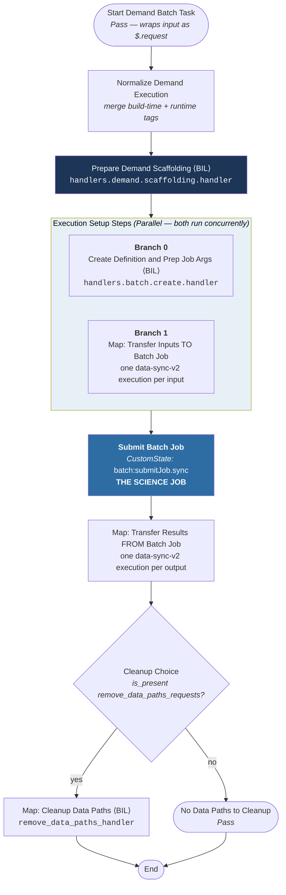

### 5.3 Main flow: ASCII fallback

Paste-safe, and annotated. Useful where Mermaid does not render.

```
                       ┌──────────────────────────────────────────┐
   DemandExecution ───►│ Pass "Start Demand Batch Task"           │  wraps input under $.request
        (JSON)         │   $.request = {demand_execution,         │  and injects the CDK-supplied
                       │                file_system_configurations}│  file system configuration
                       └───────────────────┬──────────────────────┘
                                           │
                       ┌───────────────────▼──────────────────────┐
                       │ "Normalize Demand Execution"             │  merge build-time tags with
                       │   merge_defaults -> execution_metadata.  │  runtime tags; $-prefixed
                       │   tags                                   │  values resolve from context
                       └───────────────────┬──────────────────────┘
                                           │
                       ┌───────────────────▼──────────────────────┐
                       │ "Prepare Demand Scaffolding"      ⟨BIL⟩  │  ONE Batch job.
                       │   handlers.demand.scaffolding.handler    │  Resolves EFS mounts, rewrites
                       │                                          │  param paths, writes .demand.env,
                       │   OUT: setup_configs   {data_sync_reqs,  │  emits every downstream request.
                       │                         batch_create_req}│
                       │        cleanup_configs {data_sync_reqs,  │
                       │                         remove_paths_reqs}│
                       └───────────────────┬──────────────────────┘
                                           │
             ╔═════════════════════════════▼══════════════════════════════════════╗
             ║ PARALLEL "Execution Setup Steps"                                   ║
             ║   input_path = $.config.scaffolding.setup_configs                  ║
             ║   result_selector keeps ONLY branch [0] as batch_args              ║
             ║                                                                    ║
             ║  branch 0                          branch 1                        ║
             ║  ┌──────────────────────────┐      ┌─────────────────────────────┐ ║
             ║  │ "Create Definition and   │      │ MAP "Transfer Inputs TO     │ ║
             ║  │  Prep Job Args"   ⟨BIL⟩  │      │      Batch Job"             │ ║
             ║  │  handlers.batch.create.  │      │  items: data_sync_requests  │ ║
             ║  │  handler                 │      │  ┌────────────────────────┐ │ ║
             ║  │                          │      │  │ per item: START EXEC   │ │ ║
             ║  │  registers Batch job def │      │  │  data-sync-v2  (.sync) │ │ ║
             ║  │  -> job_definition_arn,  │      │  │  result -> DISCARD     │ │ ║
             ║  │     job_name, job_queue, │      │  └────────────────────────┘ │ ║
             ║  │     container_overrides  │      │  (one Batch job per input)  │ ║
             ║  └──────────────────────────┘      └─────────────────────────────┘ ║
             ╚═════════════════════════════╦══════════════════════════════════════╝
                                           │  (barrier: both branches complete)
                       ┌───────────────────▼──────────────────────┐
                       │ "Submit Batch Job"                       │
                       │   CustomState, Resource =                │  ####################
                       │   arn:aws:states:::batch:submitJob.sync  │  #  THE SCIENCE JOB #
                       │   JobName / JobDefinition / JobQueue /   │  ####################
                       │   ContainerOverrides  <- batch_args      │
                       │   Tags <- execution_metadata.tags        │
                       │   PropagateTags = true                   │
                       └───────────────────┬──────────────────────┘
                                           │
                       ┌───────────────────▼──────────────────────┐
                       │ MAP "Transfer Results FROM Batch Job"    │
                       │   items: cleanup_configs.                │  one Batch job per output
                       │          data_sync_requests              │  (EFS -> S3, retain=False)
                       └───────────────────┬──────────────────────┘
                                           │
                       ┌───────────────────▼──────────────────────┐
                       │ CHOICE "Cleanup Choice"                  │
                       │   is_present(cleanup_configs.            │
                       │              remove_data_paths_requests)?│
                       └────────┬────────────────────────┬────────┘
                            yes │                        │ no
                       ┌────────▼─────────────────┐  ┌───▼──────────────────────┐
                       │ MAP "Cleanup Data Paths" │  │ Pass "No Data Paths to   │
                       │  per item:        ⟨BIL⟩  │  │       Cleanup"           │
                       │  remove_data_paths_handler│ └───┬──────────────────────┘
                       │  (<=2 items: inputs,     │      │
                       │   working dir)           │      │
                       └────────┬─────────────────┘      │
                                └───────────┬────────────┘
                                            ▼
                                          (End)

   ⟨BIL⟩ = runs via the batch-invoked-lambda state machine -> one AWS Batch job.
```

### 5.4 State by state

| # | State | Type | Key paths | Source (`cdk:…/demand_execution.py`) |
|---|---|---|---|---|
| 1 | `Start Demand Batch Task` | `Pass` | Wraps input as `{request: {demand_execution: $, file_system_configurations: {…}}}` | `:134-140` |
| 2 | `Normalize Demand Execution` | `Parallel` enclosure | in/out `$.request.demand_execution` | `:145-151` |
| 3 | `Prepare Demand Scaffolding` | `Parallel` enclosure | in `$.request`, out `$.config.scaffolding` | `:153-177` |
| 4 | `Execution Setup Steps` | `Parallel`, 2 branches | in `$.config.scaffolding.setup_configs`, out `…setup_results`, `result_selector {batch_args.$: $[0]}` | `:205-230` |
| 5 | `Submit Batch Job` | `CustomState` | out `$.tasks.batch_submit_task` | `:232-259` |
| 6a | `Transfer Results FROM Batch Job` | `Map` | in `…cleanup_configs.data_sync_requests`, out `$.tasks.cleanup.cleanup_results.transfer_results` | `:261-277` |
| 6b | `Cleanup Choice` | `Choice` | tests presence of `…cleanup_configs.remove_data_paths_requests` | `:278-282` |
| 6c | `Map: Cleanup Data Paths` | `Map` | out `$.tasks.cleanup.cleanup_results.remove_data_paths_results` | `:284-314` |
| 6d | `No Data Paths to Cleanup` | `Pass` | — | `:316` |

**On the `Execution Setup Steps` parallel (`:205-230`):**

- The branches run **concurrently** — registering the job definition happens while inputs stage from
  S3. The state does not complete until both finish.
- `result_selector` `{"batch_args.$": "$[0]"}` (`:211`) keeps **only branch 0's output**. Branch 1's
  is discarded, and the `Transfer Input` iterator additionally sets `result_path=DISCARD` (`:226`).
  **Input transfer results are retained nowhere.** They are fire-and-verify-by-failure: the only
  signal is whether the branch succeeded.
- Branch ordering matters: `$[0]` is branch 0 because `.branch()` was called on the
  create-definition task first (`:213`).

**On `Submit Batch Job` (`:232-259`)** — a raw `CustomState`, not a CDK task construct. It reads
everything from scaffolding output:

```
JobName            <- $.config.scaffolding.setup_results.batch_args.job_name
JobDefinition      <- $.config.scaffolding.setup_results.batch_args.job_definition_arn
JobQueue           <- $.config.scaffolding.setup_results.batch_args.job_queue_arn
Parameters         <- $.config.scaffolding.setup_results.batch_args.parameters
ContainerOverrides <- $.config.scaffolding.setup_results.batch_args.container_overrides
Tags               <- $.request.demand_execution.execution_metadata.tags
PropagateTags      = true
```

It uses `arn:aws:states:::batch:submitJob.sync`, so the state machine blocks until the Batch job
reaches a terminal state.

### 5.5 Why the console graph is bigger than the diagram

Almost every logical step above is wrapped by `CommonOperation.enclose_chainable`
(`cdk:constructs_/sfn/states/common.py:124`), which converts a chain into a single-state `Parallel`
plus a follow-up `Pass` that unwraps the `[0]` array element:

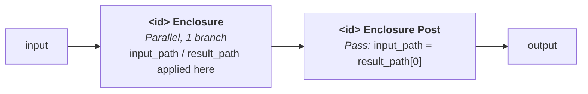

A `Parallel` state is the only clean way to scope `input_path`/`result_path` around a *multi-state
chain*. The consequence: **in the AWS console, each logical step renders as a Parallel box
containing 2–6 states, followed by a restructuring Pass. A "6-step" state machine is roughly 30–40
actual states.** If you are debugging in the console and cannot find the step you're looking for,
this is why.

`CommonOperation.merge_defaults` (`states/common.py:11`) adds more: with
`check_if_target_present=True` it emits a `Check Target` Choice, `Target Present` /
`Target Not Present` Passes, and a `Merge Pass`, all inside another enclosure.

### 5.6 Tag normalization

Step 2 is exactly a `merge_defaults` shape (`cdk:…/demand_execution.py:331-362`). Build-time tags
supplied to the fragment are merged into `$.request.demand_execution.execution_metadata.tags`, with
**runtime values winning** (`order_of_preference="target"`, the default). A build-time tag whose
value starts with `$` is rewritten to a JSONPath key (`"{k}.$"`), letting it resolve against the
demand execution (`:349-352`). The reference app uses this for cost allocation
(`cdk:aibs_informatics_core_app/stacks/demand_execution.py:161-165`):

```
ai:cost-allocation:aibs-informatics-service        = "n/a"
ai:cost-allocation:aibs-informatics-workflow-type  = $.execution_type
ai:cost-allocation:aibs-informatics-workflow-id    = $.execution_id
```

With `PropagateTags: true` on the science job (`:255`), these land on the ECS tasks.

### 5.7 The JSON path map

The fragment threads results through a fixed set of paths (`cdk:…/demand_execution.py:59-63`):

| Path | Written by | Contains |
|---|---|---|
| `$.request` | `Pass: Start Demand Batch Task` | `{demand_execution, file_system_configurations, context_manager_configuration?}` |
| `$.config.scaffolding` | `Prepare Demand Scaffolding` | `PrepareDemandScaffoldingResponse` |
| `$.config.scaffolding.setup_results.batch_args` | `Parallel` result_selector `$[0]` | `CreateDefinitionAndPrepareArgsResponse` |
| `$.tasks.batch_submit_task` | `Submit Batch Job` | Batch `DescribeJobs`-shaped result |
| `$.tasks.cleanup.cleanup_results.transfer_results` | output `Map` | array (per-item results `DISCARD`ed inside) |
| `$.tasks.cleanup.cleanup_results.remove_data_paths_results` | cleanup `Map` | array of `RemoveDataPathsResponse` |

## 6. `batch-invoked-lambda` in detail

Built by `BatchInvokedLambdaFunction.with_defaults` (`cdk:constructs_/sfn/fragments/informatics/batch.py:217`),
instantiated at `cdk:…/stacks/demand_execution.py:125-136`. Overall chain:
`start → put_payload → submit_job → get_response` (`batch.py:206`).

### 6.1 The sequence

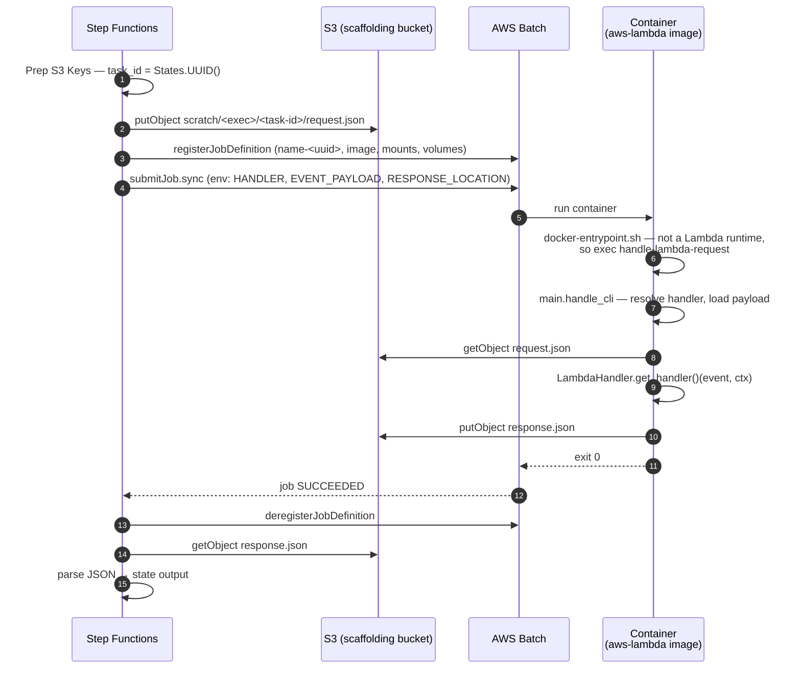

The S3 handoff (`cdk:…/informatics/batch.py:123-132`):

```
request  s3://<scaffolding-bucket>/scratch/<execution-name>/<task-id>/request.json
response s3://<scaffolding-bucket>/scratch/<execution-name>/<task-id>/response.json
```

`<task-id>` is a `States.UUID()` generated in the `Prep S3 Keys` Pass (`batch.py:134-141`), so
concurrent invocations inside one execution do not collide. The `scratch/` prefix comes from
`S3_SCRATCH_KEY_PREFIX` (`aws-utils:constants/s3.py:13`).

### 6.2 The entrypoint switch

One image serves both roles because of `lambda:docker/docker-entrypoint.sh`:

```bash
if expr "$AWS_EXECUTION_ENV" : "AWS_LAMBDA_"; then
  exec python -m awslambdaric "$@"      # real Lambda
else
  handle-lambda-request "$@"            # ECS/Batch
fi
```

`handle-lambda-request` is the console script for `main:handle_cli` (`lambda:pyproject.toml:54`).
`handle_cli` (`lambda:main.py:59-165`) reads three env vars, downloads the payload if it is an S3
URI (`:135-139`), invokes the resolved handler with a `DefaultLambdaContext` (`:142`), and uploads
the response (`:149-151`). The image is built on `public.ecr.aws/lambda/python:3.11`
(`lambda:docker/Dockerfile`), which is why it can act as either.

**Handler base class.** All handlers derive from `LambdaHandler` (`lambda:common/handler.py:38`), a
generic over `(REQUEST, RESPONSE)` model types. `get_handler()` (`:107-159`) returns a closure that
injects the Lambda context, deserializes the event into the request model, calls `handle()`, and
serializes the response. So the handlers really are Lambda-compatible — they just are not deployed
that way here.

### 6.3 The environment contract

Injected into every ⟨BIL⟩ container (`cdk:…/informatics/batch.py:157-173`):

| Variable | Value |
|---|---|
| `AWS_LAMBDA_FUNCTION_NAME` | logical handler name, e.g. `data-sync` |
| `AWS_LAMBDA_FUNCTION_HANDLER` | fully-qualified handler path |
| `AWS_LAMBDA_EVENT_PAYLOAD` | `s3://<bucket>/<request key>` |
| `AWS_LAMBDA_EVENT_RESPONSE_LOCATION` | `s3://<bucket>/<response key>` |
| `ENV_BASE` | environment base |
| `AWS_REGION`, `AWS_ACCOUNT_ID` | from the construct's stack |

Same image, same code path, every handler. Only these vars differ.

### 6.4 Job definition lifecycle

`SubmitJobFragment` (`cdk:constructs_/sfn/fragments/batch.py:39`) registers a **fresh job definition
per invocation**, named `<name>-<States.UUID()>` (`cdk:constructs_/sfn/states/batch.py:88-90`),
submits against it, then deregisters (`fragments/batch.py:129`). A catch on submit deregisters and
then fails (`:116-127`), so a failed submission does not leak a definition.

**Job definition churn is proportional to invocation count** — every data sync, every scaffolding
call, every cleanup registers and deregisters one. (The *science* job's definition is handled
differently and is deliberately shared across executions — see [§14, D5](#14-design-decisions).)

## 7. The handlers

Every compute state in the demand execution path is a batch-invoked lambda. None run on real AWS
Lambda. The only Lambda-shaped invocation is the container's own dispatch.

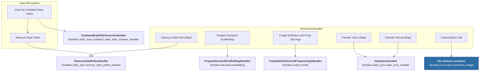

| State | Handler | Request → Response | Job queue |
|---|---|---|---|
| Prepare Demand Scaffolding | `PrepareDemandScaffoldingHandler` `lambda:handlers/demand/scaffolding.py:36` | `PrepareDemandScaffoldingRequest` `demand/model.py:112` → `…Response` `:170` | scaffolding |
| Create Definition and Prep Job Args | `CreateDefinitionAndPrepareArgsHandler` `lambda:handlers/batch/create.py:85` | `…Request` `batch/model.py:29` → `…Response` `:65` | scaffolding |
| Transfer Input / Result | `DataSyncHandler` `lambda:handlers/data_sync/operations.py:154` | `DataSyncRequest` `core:models/data_sync.py:95` → `DataSyncResponse` `:137` | data sync |
| **Submit Batch Job** | — the caller's image | — | **from `DemandExecution`** |
| Cleanup Data Path | `RemoveDataPathsHandler` `lambda:handlers/data_sync/file_system.py:168` | `RemoveDataPathsRequest` `data_sync/model.py:114` → `…Response` `:124` | scaffolding |
| Scan for Outdated Data Paths | `OutdatedDataPathScannerHandler` `lambda:handlers/data_sync/file_system.py:101` | `…Request` `data_sync/model.py:136` → `…Response` `:157` | execution |
| Remove Data Paths (sweep) | `RemoveDataPathsHandler` | as above | execution |

The `Cleanup Data Path` states use the shared `batch_invoked_lambda_kwargs`
(`cdk:…/demand_execution.py:299`), which carries the **scaffolding** queue (`:70-72`, wired from
`stacks/demand_execution.py:156`).

**Defined but unreachable from the demand execution path:** `GetJSONFromFileHandler`,
`PutJSONToFileHandler`, `BatchDataSyncHandler`, `PrepareBatchDataSyncHandler`,
`GetDataPathStatsHandler`, `ListDataPathsHandler` (`lambda:handlers/data_sync/__init__.py:1-11`).
`get_data_path_stats_fragment` (`cdk:…/informatics/efs.py:21`) is likewise defined and never
instantiated.

## 8. Paths, parameters, and the container environment

All path derivation happens in `DemandExecutionContextManager`
(`lambda:handlers/demand/context_manager.py:148`).

### 8.1 Path derivation rules

| Property | Rule | Example (deployed) | Source |
|---|---|---|---|
| `container_working_path` | scratch mount ∕ `execution_id` | `/opt/scratch/exec-123` | `:205-218` |
| `container_shared_path` | the shared mount point itself | `/opt/shared` | `:234-244` |
| `container_tmp_path` | tmp mount if present, else scratch mount ∕ `tmp` | `/opt/scratch/tmp` | `:220-232` |
| `efs_working_path` | `get_efs_path(container_working_path)` | `fs-0abc:/scratch/exec-123` | `:246-256` |

> **The docstrings and the deployment disagree, harmlessly.** Docstrings in `context_manager.py` —
> and the handler defaults used when a request omits `container_path`
> (`lambda:handlers/demand/scaffolding.py:75-103`) — say `/opt/efs/scratch` and `/opt/efs/shared`.
> But the reference app always passes explicit paths: **`/opt/scratch` and `/opt/shared`**
> (`cdk:…/stacks/demand_execution.py:118-123`). The EFS *URI* is identical either way; only the
> container-visible prefix differs. The `/opt/efs/{role}` defaults are a fallback the reference app
> never exercises.

### 8.2 Inputs, and `isolate_inputs`

`update_demand_execution_parameter_inputs` (`context_manager.py:478-532`) has two branches:

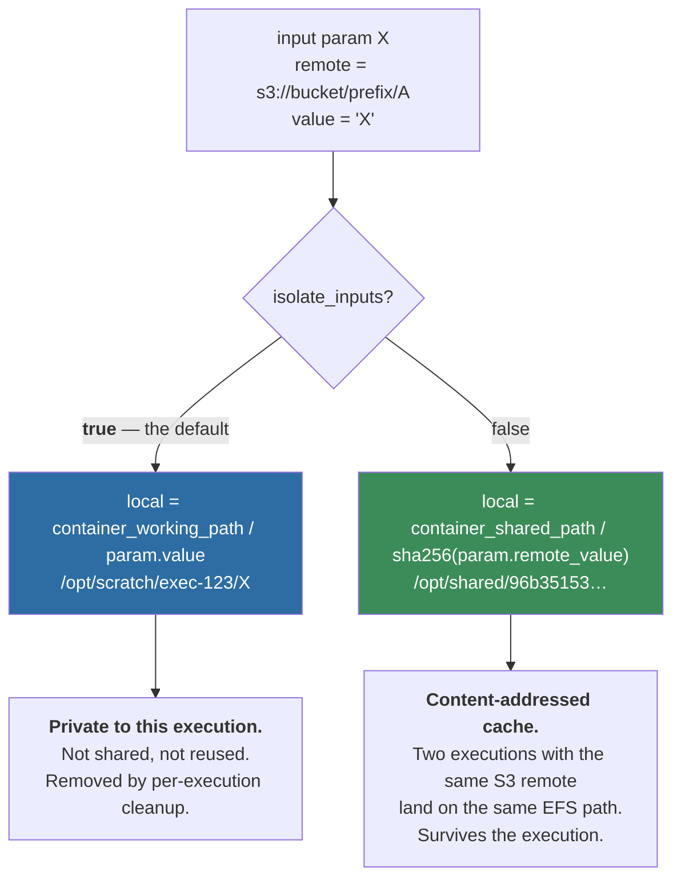

| | `isolate_inputs=True` (default) | `isolate_inputs=False` |
|---|---|---|
| Input local path | `{working_dir}/{resolvable.local}` | `{shared_mount}/{sha256(remote_value)}` |
| Volume role | `scratch` (read-write) | `shared` (read-only to the science job) |
| Cross-execution reuse | none — every execution re-downloads | yes, content-keyed cache hit |
| Cleaned up by | per-execution cleanup | the daily janitor only |
| Safe if the job mutates its input | yes | **no** |

**`isolate_inputs` defaults to `True`** (`lambda:handlers/demand/model.py:100`), so **the shared
content-addressed cache is off by default** and the shared volume is typically empty. That
interacts badly with EFS bursting — see [§17.1](#171-efs-bursting-is-the-underlying-problem).

**When the cache *is* on**, the path is `{shared_mount}/{sha256_hexdigest(param.remote_value)}`
(`context_manager.py:525`). The digest is over the **remote S3 URI string, not the content**.
Consequences:

- Two params in one execution, or two separate executions, pointing at the same S3 URI resolve to
  the same EFS path and share one download.
- Cache validity is decided at sync time by `should_sync` ([§10.3](#103-whether-to-transfer-at-all)),
  not by the digest — the digest decides *where*, never *whether*.
- Because the key is the URI, **mutating the S3 object does not invalidate the path.** Freshness
  rests entirely on `should_sync`'s size/mtime/ETag comparison, and the demand path sets
  `size_only=True`, which skips the ETag check. A same-size replacement with an older-or-equal mtime
  would not be re-downloaded. **(inferred from `should_sync` at `aws-utils:s3.py:1266-1274`; not
  observed live.)**
- Input syncs set `require_lock=True` (`context_manager.py:360`), so concurrent executions targeting
  the same cached path serialize on a file lock rather than corrupting each other.

Verified against tests: with `isolate_inputs=False` the destination is
`fs-…:/shared/558ca1533e03…becbf4f`; with `isolate_inputs=True`, cleanup paths are
`fs-…:/scratch/<exec_id>/X` (`lambda:test/.../test_context_manager.py:663`, `:833-834`).

> **Watch the two different defaults.** `ContextManagerConfiguration.isolate_inputs` defaults to
> `True` (`lambda:handlers/demand/model.py:100`), but the *function* parameter
> `update_demand_execution_parameter_inputs(isolate_inputs=...)` defaults to `False`
> (`context_manager.py:482`). The live caller passes the config value explicitly (`:199`), so the
> effective default is `True` — but a new caller of that function gets the opposite behavior
> unless it is explicit.

### 8.3 Outputs

`update_demand_execution_parameter_outputs` (`context_manager.py:535-576`) is unconditional — no
isolate/share choice:

```
local  = container_working_path / param.value   →  /opt/scratch/exec-123/results
remote = param.remote_value                     →  s3://out-bucket/run1/results/
```

Output sync requests (`:372-407`) invert the direction and differ from inputs in two ways:
`retain_source_data=False` (the EFS copy is deleted after upload) and `require_lock=False`.

### 8.4 Command and environment

`generate_batch_job_builder` (`context_manager.py:630-826`) builds both.

**Environment** (`:681-689`): `EXECUTION_ID`, `WORKING_DIR`, `TMPDIR`, plus one variable per job
param. `JobParam.update_environment` writes `ENVNAME → value`
(`core:models/demand_execution/job_param.py:82-91`), upper-snake-cased (`:11-18`), where the value
is the **container path** for resolvables.

**Command** (`:692-696`, `:792`), wrapped as `["/bin/bash", "-c", …]` (`:810`):

```
mkdir -p ${WORKING_DIR} && mkdir -p ${TMPDIR} && cd ${WORKING_DIR} [&& . ${_ENVIRONMENT_FILE}] && <command>
```

### 8.5 The `.demand.env` offload

Batch container overrides cap environment size at roughly **8192 characters**, and demand executions
with many params blow past it. So `generate_batch_job_builder` (`:715-788`):

1. Computes the env file path three ways — container path, EFS URI, and local path on the machine
   running this code (`:723-727`).
2. If `get_local_path(..., raise_if_unmounted=False)` returns `None` — i.e. the scaffolding job
   cannot reach that filesystem — it **falls back to inline env vars** with a loud warning
   (`:731-744`) stating that the container may fail past 8192 characters.
3. Otherwise it scans the command and pre-commands for `\$\{?([\w]+)\}?` references (`:774-777`).
   Referenced variables stay inline; everything else is written to `<working_dir>/.demand.env`
   **directly onto EFS from the scaffolding container** (`:784-785`), replaced by a single
   `_ENVIRONMENT_FILE` variable (`:780-781`), with `. ${_ENVIRONMENT_FILE}` appended to the
   pre-commands (`:788`).

`EnvFileWriteMode` (`lambda:handlers/demand/model.py:47`) has three values; the default is `ALWAYS`
(`model.py:103`). `IF_REQUIRED` only writes when the environment exceeds 90% of 8192 bytes
(`context_manager.py:747-758`).

Two things worth knowing:

- **This is why the scaffolding job must run on Batch with EFS mounted**, not as a plain Lambda.
  Remove the root mount from infra jobs and every execution silently degrades to inline env vars.
- The regex is a textual scan. A variable referenced *indirectly* gets moved to the env file — fine,
  since the file is sourced — but a variable referenced *before* `. ${_ENVIRONMENT_FILE}` would not
  be. Today the pre-commands are fixed and reference only `WORKING_DIR` and `TMPDIR`, both of which
  the scan catches.

## 9. Storage and mounts

### 9.1 One file system, four access points

`EFSEcosystem` (`cdk:constructs_/efs/file_system.py:189`) creates a single EFS file system and four
access points (`:240-249`):

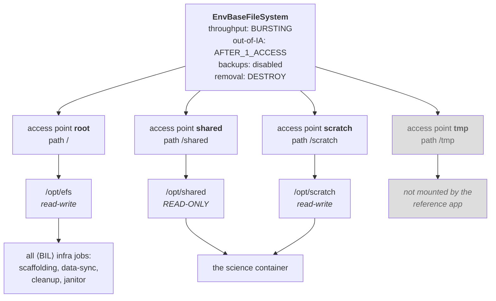

Path constants: `aws-utils:constants/efs.py:24-27` (`/`, `/shared`, `/scratch`, `/tmp`), access point
names at `:32-35`.

Access points are created via `EnvBaseFileSystem.create_access_point`
(`cdk:constructs_/efs/file_system.py:115`), which uses `efs.CfnAccessPoint` rather than the L2
construct because the L2 does not support tagging — and **tags are how access points are found by
name at runtime** (`:120`, resolution at `:115-131`). Every access point gets POSIX uid/gid `0` and
root-directory permissions `0777` (`:144-155`). Combined with `privileged=True` on the science job
(`context_manager.py:822`), **there is effectively no POSIX isolation between executions**;
isolation comes from directory naming, not permissions.

> There is a near-identical module-level `create_access_point` function at
> `cdk:constructs_/efs/file_system.py:444` that nothing calls. If you are grepping for access point
> creation you will find both; the live one is the method at `:115`.

### 9.2 Volume roles, and who mounts what

| Role | Access point | Container path (deployed) | Mode | Purpose |
|---|---|---|---|---|
| `shared` | `shared` (`/shared`) | `/opt/shared` | **read-only** | Content-addressed input cache (only when `isolate_inputs=False`) |
| `scratch` | `scratch` (`/scratch`) | `/opt/scratch` | read-write | Per-execution working directories, `<exec_id>/` |
| `tmp` | `tmp` (`/tmp`) | — | read-write | Optional; **not configured in the reference app** |
| `root` | `root` (`/`) | `/opt/efs` | read-write | Infrastructure jobs that need to see the whole filesystem |

Set at `cdk:…/stacks/demand_execution.py:115-123`; `EFS_MOUNT_PATH = "/opt/efs"` (`:40`).

The science container sees `/opt/shared` and `/opt/scratch`. Every infrastructure job sees the
whole filesystem at `/opt/efs` — hence `/opt/efs/scratch/…` in transfer-job logs. **That root mount
is not incidental**: it is what lets the scaffolding job write `.demand.env` into the science job's
working directory, and what lets the cleanup job delete a path it never mounted by role.

**`tmp` is not passed.** `DemandExecutionFragment` is constructed with only `shared` and `scratch`
mount configs (`cdk:…/stacks/demand_execution.py:159-160`); `tmp_mount_point_config` defaults to
`None` (`cdk:…/demand_execution.py:39`). So `file_system_configurations` carries only `shared` and
`scratch` (`:76-125`), the scaffolding handler skips the tmp branch
(`lambda:handlers/demand/scaffolding.py:93-106`), and `container_tmp_path` falls back to
`{scratch}/tmp` — i.e. `/opt/scratch/tmp` (`context_manager.py:230-232`).

### 9.3 From access point to running container

Two parallel implementations produce Batch mount points and volumes — one at synth time in CDK, one
at runtime in the handler:

| | CDK (synth time) | Handler (runtime) |
|---|---|---|
| Class | `MountPointConfiguration` `cdk:constructs_/efs/file_system.py:272` | `MountPointConfiguration` `aws-utils:efs/mount_point.py:52` + `BatchEFSConfiguration` `context_manager.py:67` |
| Mount point | `to_batch_mount_point()` `:395` | `to_mount_point()` `context_manager.py:115-117` |
| Volume | `to_batch_volume()` `:412` | `to_volume()` `context_manager.py:118` |
| Volume name | `efs-vol{i}` or role name | `{fs_name_or_id}-{mount-path-dashed}-vol` `context_manager.py:98-103` |

Both emit the same EFS volume configuration when an access point is used:

```json
{
  "fileSystemId": "fs-0abc123",
  "transitEncryption": "ENABLED",
  "authorizationConfig": { "accessPointId": "fsap-0def456", "iam": "DISABLED" }
}
```

(`cdk:constructs_/efs/file_system.py:422-431`; `context_manager.py:105-114`.)

The runtime version additionally sets `"rootDirectory": "/"` alongside the access point
(`context_manager.py:107`), while the CDK version sets `rootDirectory` **only** when there is no
access point (`file_system.py:432-433`). **(Difference read from source; whether Batch objects to
the redundant field was not determined.)**

### 9.4 Runtime mount discovery

A container that needs to translate paths but was not told its mounts calls `detect_mount_points()`
(`aws-utils:efs/mount_point.py:400`), which tries three strategies in order:

1. `AWS_BATCH_JOB_ID` present → `batch.describe_jobs()`, read `container.mountPoints` and
   `container.volumes` (`:483-518`)
2. `AWS_LAMBDA_FUNCTION_NAME` present → `lambda.get_function_configuration()`, read
   `FileSystemConfigs` (`:466-480`)
3. else → scan env vars prefixed `EFS_MOUNT_POINT_PATH_` / `EFS_MOUNT_POINT_ID_` (`:521-557`)

Results are deduplicated by container path, raising on conflicts (`:426-458`); mount points that are
not existing directories are dropped (`:560-577`). The function is `@cache`d — detection happens once
per process.

In the demand path this matters for `RemoveDataPathsHandler`, which uses it to resolve EFS URIs back
to local paths (`lambda:handlers/data_sync/file_system.py:199-201`). The **scaffolding handler does
not** rely on detection — it builds mount points explicitly from `file_system_configurations` in its
request (`scaffolding.py:69-106`, `:188-194`), resolving access points by tag `{"env_base": env_base}`.

## 10. Data sync

### 10.1 The layers

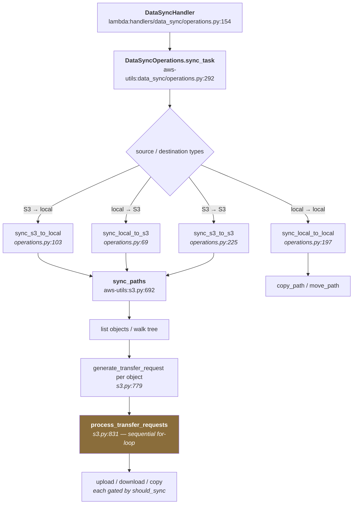

### 10.2 How a transfer executes, and where concurrency comes from

`sync_paths` (`aws-utils:s3.py:692-776`):

1. **Enumerate.** S3 source → `list_s3_paths` on the prefix, plus the object itself if it is also an
   object (`:715-723`). Local source → `find_paths` walks the tree, files only (`:724-733`).
2. **Build one transfer request per object** (`:736-744`), preserving the path relative to
   `source_path_prefix` (`generate_transfer_request`, `:779-828`).
3. **Process them** (`process_transfer_requests`, `:831-904`) — **a plain sequential `for` loop.**
   No thread pool, no batching across objects, no fan-out.
4. **Delete extras** if `delete=True` (`:754-769`).

> **This is the most commonly misunderstood part of the system.** Concurrency comes *only* from
> boto3's `TransferConfig(max_concurrency=…)` (`aws-utils:data_sync/operations.py:62-63`), which
> parallelizes **multipart parts within a single file**, plus `botocore.Config(max_pool_connections=…)`
> (`:66-67`). Default `max_concurrency=25` (`core:models/data_sync.py:85`).
>
> So a sync of **10,000 small files is effectively serial**. A sync of **one 100 GB file is
> parallel**. Transfer time is a function of file *count* far more than total bytes.

Parallelism *across* inputs comes only from the Step Functions `Map` over `data_sync_requests`
(`cdk:…/demand_execution.py:215-229`), which sets no `max_concurrency` — so SFN applies its default
and the effective ceiling is the Batch queue's capacity. **(inferred: no `max_concurrency` argument
appears at `:215-219`.)** Each data-sync job is fixed at **1024 MiB / 1 vCPU**
(`cdk:…/informatics/data_sync.py:88-89`) regardless of transfer size.

### 10.3 Whether to transfer at all

`should_sync` (`aws-utils:s3.py:1170-1274`) mirrors `aws s3 sync`. A transfer happens if:

- the destination is missing, **or**
- sizes differ, **or**
- the source mtime is newer (whole-second precision), **or**
- (`size_only=False` only) ETags differ.

**The demand path sets `size_only=True`** (`lambda:handlers/demand/model.py:81`), so the ETag
comparison is skipped. See the cache-staleness consequence in [§8.2](#82-inputs-and-isolate_inputs).

### 10.4 Direction-specific behavior

**S3 → EFS** (`aws-utils:data_sync/operations.py:103-195`):

- **Destination locking.** With `require_lock=True` — which input syncs set — the sync wraps in a
  `PathLock` on the destination and retries for up to **6 hours** at 5-second intervals (`:45`,
  `:121-136`). This is what makes the shared content-addressed cache safe under concurrency.
- **Custom tmp dir** (`:138-167`), off by default (`core:models/data_sync.py:72-79`). When on, and
  the source is a single object, the download goes to a temp dir on the same filesystem and is
  `os.rename`d into place. The comment explains why: an interrupted boto3 download leaves a partial
  file like `*.6eF5b5da` **in the destination directory**, which tools such as cellranger may pick
  up as a real input (`:143-148`).
- **mtime refresh** (`:181-182` → `:347-353`): every downloaded file gets its mtime bumped forward
  to at least the sync start time. Deliberate — the janitor is age-based, so touching files on sync
  protects freshly-staged data from being swept.
- `retain_source_data=False` is **ignored** in this direction, with a warning — a download never
  deletes S3 objects (`:184-188`).

**EFS → S3** (`:69-101`):

- If the source is a directory, a folder suffix is added to the destination key (`:79-84`).
- `delete=True` always (`:93`) — see the warning in [§15](#15-sharp-edges-warts-and-latent-bugs).
- `retain_source_data=False` **is** honored — `remove_path(source_path)` after upload (`:99-100`).
  Output syncs set this, so **outputs are removed from EFS as soon as they are uploaded**.

### 10.5 The distributed path that isn't wired in

There are two data-sync fragment shapes in `cdk:constructs_/sfn/fragments/informatics/data_sync.py`:

**`DataSyncFragment` (`:24`)** — a `Pass` that restructures input into `{handler, image, payload}`,
then one embedded `BatchInvokedLambdaFunction` running `data_sync_handler` at 1024 MiB / 1 vCPU.
One Batch job, one transfer. **This is what the reference app deploys**, as `data-sync-v2`.

**`DistributedDataSyncFragment` (`:124`)** — a genuinely parallel two-phase fan-out:

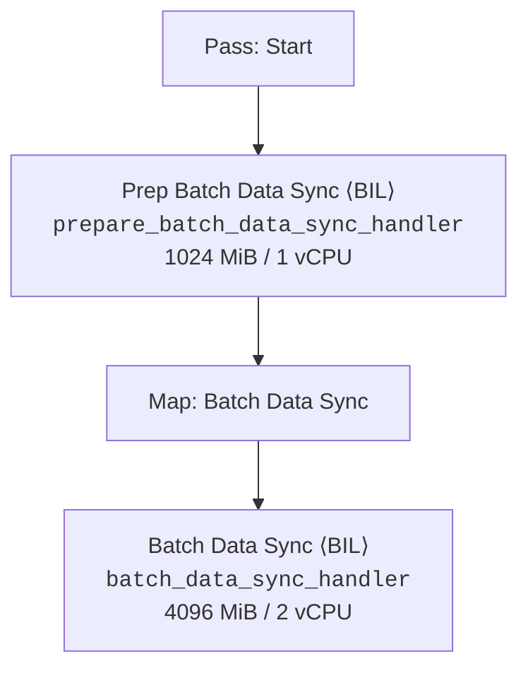

`PrepareBatchDataSyncHandler` (`lambda:handlers/data_sync/operations.py:237`) builds a filesystem
tree over the source (`S3FileSystem` / `LocalFileSystem`, `aws-utils:data_sync/file_system.py:295,232`),
calls `partition()` to split it into subtrees under a byte limit (`file_system.py:168`), then
bin-packs those nodes with **first-fit decreasing** (`operations.py:346-397`). Nodes larger than the
limit become their own batch (`:379-380`). Default limit 250 GiB (`:247`), overridden to 75 GiB by
the demand context manager (`context_manager.py:361,398`).

> **Nothing instantiates `DistributedDataSyncFragment`.** It is exported from
> `informatics/__init__.py` but has no callers anywhere in the CDK library or the reference app.
>
> The scaffolding handler nonetheless emits `PrepareBatchDataSyncRequest` objects carrying
> `batch_size_bytes_limit` (75 GiB) and `temporary_request_payload_path`
> (`context_manager.py:352-365`, `:392-402`) — fields that only `PrepareBatchDataSyncHandler`
> understands. The demand path routes to `data-sync-v2` → `DataSyncHandler`, whose request model is
> plain `DataSyncRequest`. Because `PydanticBaseModel` uses `extra="ignore"`
> (`core:models/base/_pydantic_model.py:25`), **both fields are silently dropped.**
>
> So in deployed behavior: each input and each output is one Batch job running one sequential
> `sync_paths` loop, and the 75 GiB batching limit has **no effect**. This is not a bug — it is a
> wired-for-later path (the models even carry a comment about the union ordering needed to preserve
> the fields across the SFN boundary, `lambda:handlers/demand/model.py:141-146`). But **"we bin-pack
> large inputs" is not true of this deployment.**

## 11. Cleanup: two separate mechanisms

These are easy to conflate. They share the `RemoveDataPathsHandler` implementation and nothing else.

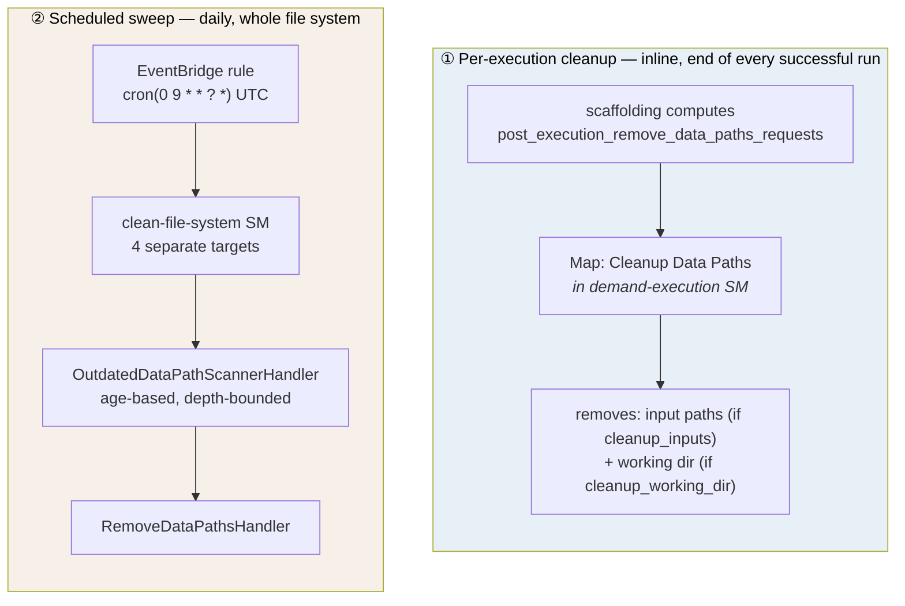

| | ① Per-execution | ② Scheduled sweep |
|---|---|---|
| Trigger | End of each demand execution | EventBridge, daily 09:00 UTC |
| State machine | `demand-execution` | `clean-file-system` |
| Decides what to delete | `DemandExecutionContextManager`, at scaffolding time | `OutdatedDataPathScannerHandler`, at scan time |
| Criterion | Config flags — which paths this run created | Age: newest file older than 3 days |
| Scope | This execution's inputs and working dir | `/tmp`, `/scratch`, `/scratch/tmp`, `/shared` |
| Runs when the job fails | **No** — no catch on the SM | Yes — it is independent |
| Job queue | scaffolding | execution |

### 11.1 Per-execution cleanup

`post_execution_remove_data_paths_requests` (`context_manager.py:409-425`) builds **up to two**
requests:

1. If `cleanup_inputs` (default `True`, `lambda:handlers/demand/model.py:101`) — one request listing
   every downloadable input's EFS path (`:417-421`).
2. If `cleanup_working_dir` (default `True`, `model.py:102`) — one request for `efs_working_path`
   (`:423-424`).

Both default on, so the default is **delete the inputs, then delete the whole working directory**.
With `isolate_inputs=True` the inputs are *inside* the working directory, making request 1
redundant — but harmless, since `RemoveDataPathsHandler` tolerates `FileNotFoundError`
(`lambda:handlers/data_sync/file_system.py:210-211`).

If both flags are false, `remove_data_paths_requests` is an empty list — and the `Cleanup Choice`
`is_present` test (`cdk:…/demand_execution.py:280-282`) still passes, because the key exists. The
Map then iterates zero items. **(inferred: `is_present` checks key presence, not emptiness; the
empty list is serialized because `DemandExecutionCleanupConfigs` has `default_factory=list`.)**

`RemoveDataPathsHandler` (`file_system.py:168-214`) resolves EFS URIs to local paths via
`detect_mount_points()`, sums sizes, and removes. **S3 paths are explicitly skipped with a warning**
(`:190-195`) — deleting S3 data is not implemented.

### 11.2 The scheduled sweep

Wired at `cdk:…/stacks/demand_execution.py:182-200` via `CleanFileSystemTriggerRuleConfig`
(`cdk:constructs_/sfn/fragments/informatics/efs.py:206-240`). One EventBridge rule named
`clean-file-system-trigger`, schedule `cron(minute="0", hour="9")` UTC (`efs.py:211`).

> A code comment says "around 00:00 in PST" — that's off by an hour. 09:00 UTC is **01:00 PST /
> 02:00 PDT**.

The rule has **four targets**, all the same state machine with different inputs
(`stacks/demand_execution.py:193-198`), each `{"path": "<fs-id>:<path>", "days_since_last_accessed":
3.0, "min_depth": 1, "max_depth": 1}`:

| Target path | `days_since_last_accessed` | `min_depth` | `max_depth` |
|---|---|---|---|
| `/tmp` | 3.0 | 1 | 1 |
| `/scratch` | 3.0 | 1 | 1 |
| `/scratch/tmp` | 3.0 | 1 | 1 |
| `/shared` | 3.0 | 1 | 1 |

With `min_depth = max_depth = 1`, **only immediate children of each root are candidates** — so a
whole `<exec_id>/` directory under `/scratch` is deleted or kept as a unit, never partially.

**The scanner** (`lambda:handlers/data_sync/file_system.py:110-165`) is two passes.

*Pass 1 — find stale nodes* (`:135-147`). Walk from the root. A node is stale if
`current_time - node.last_modified > days_since_last_accessed`. If stale but shallower than
`min_depth` and it has children, descend instead of marking. If not stale, descend only while within
`max_depth`. Note `node.last_modified` is the **maximum** mtime over everything beneath it
(`aws-utils:data_sync/file_system.py:128-133`), so a directory is stale only if *every* file under
it is stale.

*Pass 2 — respect a size floor* (`:149-161`):

```python
current_efs_size_bytes = fs.node.size_bytes
nodes_to_delete = sorted(stale_nodes, key=lambda n: n.last_modified, reverse=True)
while nodes_to_delete and current_efs_size_bytes > request.min_size_bytes_allowed:
    node = nodes_to_delete.pop()          # pops the OLDEST (list is newest-first)
    paths_to_delete.append(node.path)
    current_efs_size_bytes -= node.size_bytes
```

Oldest-first deletion stops once projected filesystem size drops to `min_size_bytes_allowed`. The
purpose is in the comment (`:150-152`): **EFS burst credits accrue with stored size, so deleting
everything degrades throughput.** But the reference app passes `min_size_bytes_allowed=0`
(`cdk:…/stacks/demand_execution.py:191`), disabling the floor — all stale nodes get deleted.

> **Naming trap.** The field is `days_since_last_accessed`, but the comparison uses
> `node.last_modified` (`:137`), which for local files is `st_mtime`
> (`aws-utils:data_sync/file_system.py:248`). That is **modification** time, not access time. The
> `refresh_local_path__mtime` call after every download ([§10.4](#104-direction-specific-behavior))
> is what makes mtime behave like a "last used" signal for *synced* data — but **a file merely read
> by a container is not protected.**

## 12. Failure, retry, and observability

### 12.1 What retries

| Layer | Behavior | Source |
|---|---|---|
| S3 `putObject`/`getObject` (SFN SDK integration) | 5 attempts on `S3.S3Exception`, 3 s initial, backoff 2.0, full jitter (~93 s total) | `cdk:constructs_/sfn/states/s3.py:87-97`, `:197-207` |
| Batch `registerJobDefinition`/`submitJob`/`deregisterJobDefinition` | 7 attempts on `Batch.BatchException`, 3 s initial, backoff 2.0, full jitter (~189 s total) | `cdk:constructs_/sfn/states/batch.py:140-150`, `:228-238`, `:281-291` |
| Batch job for ⟨BIL⟩ jobs | `attempts=5`, `EvaluateOnExit`: RETRY on `DockerTimeoutError*` / `Host EC2*`, EXIT otherwise | `states/batch.py:108` → `aws-utils:batch.py:144-180` |
| Batch job for the **science workload** | `attempts=5`, same `EvaluateOnExit` defaults | `lambda:handlers/demand/scaffolding.py:135`, applied at registration `lambda:handlers/batch/create.py:129` |
| `SubmitJobFragment` catch | `States.ALL` on submit → deregister job definition → `Fail` | `cdk:constructs_/sfn/fragments/batch.py:116-127` |
| S3 `SlowDown` throttling (boto3 layer) | 10 attempts, exponential jitter | `aws-utils:s3.py:915-920` |
| EFS mount point detection | 5 attempts on `NoCredentialsError` | `aws-utils:efs/mount_point.py:394-398` |
| Data sync destination lock | up to 6 hours, 5 s between attempts (4320 tries) | `aws-utils:data_sync/operations.py:45`, `:121-136` |

### 12.2 What does not

There is **no `Catch` and no top-level `Retry` on the `demand-execution` state machine itself**
(read across `cdk:…/demand_execution.py:1-383`). Any unhandled error in scaffolding, setup, submit,
or cleanup fails the whole execution.

**No execution timeout is configured.** `to_state_machine` passes `timeout=None` unless a caller
supplies one (`cdk:constructs_/sfn/fragments/base.py:400-447`), and `DemandExecutionStack` does not
(`stacks/demand_execution.py:167`).

### 12.3 Failure semantics

| Failure | Result |
|---|---|
| Scaffolding job fails | Execution fails. Nothing staged, nothing to clean. |
| An input sync fails | `Execution Setup Steps` fails → execution fails. Partially-downloaded inputs remain on EFS until the sweep. |
| Job definition registration fails | Execution fails; the catch deregisters (`fragments/batch.py:116-127`). |
| **Science job fails** | Execution fails **before** post-execution transfer and cleanup. **Outputs stay on EFS and are never uploaded; the working directory is left in place** until the daily sweep, ≥3 days later. |
| An output sync fails | Execution fails; cleanup does not run; remaining outputs stay on EFS. |
| A cleanup path is already gone | Tolerated and logged (`lambda:handlers/data_sync/file_system.py:210-211`). |

The fourth row is the operationally significant one. **A failed run leaves its outputs on EFS with
no automatic retry or upload**, and diagnosing it means looking at the scratch volume *before* the
sweep reclaims it. If you are on call: the working directory is `{scratch}/{execution_id}`, and you
have roughly three days.

### 12.4 Observability

**What exists:**

- Every state machine logs to a dedicated CloudWatch log group,
  `env_base.get_state_machine_log_group_name(…)`, retention **1 month**, removal policy `DESTROY`
  (`cdk:constructs_/sfn/fragments/base.py:50-58`, `:437-447`).
- Handlers log through AWS Lambda Powertools `Logger` with the handler class name as service
  (`lambda:common/handler.py:132-134`) and `log_event=True` — **every request payload is logged in
  full**.
- Batch job logs go to the Batch/ECS log group per job. **(inferred — no explicit log configuration
  appears in `SubmitJobFragment` or `BatchJobBuilder`; this is AWS default behavior.)**
- Job definitions and jobs are tagged; `PropagateTags: true` pushes cost-allocation tags onto the
  ECS tasks.

**What does not exist** (searched the reference app for `notification`, `sns`, `alarm`):

- No SNS topic, EventBridge failure rule, or alarm on demand execution failure.
- No CloudWatch alarms on any state machine or queue.
- **No metrics emitted by any demand execution handler**, despite `MetricsMixins`
  (`lambda:common/metrics.py:123`) being available on the base class.
- No dead-letter handling on the EventBridge sweep rule.

A `lambda:handlers/notifications/` package exists (`router.py`, `notifiers/ses.py`,
`notifiers/sns.py`) but **nothing in the demand execution stack references it**.

## 13. The infrastructure

### 13.1 Stacks

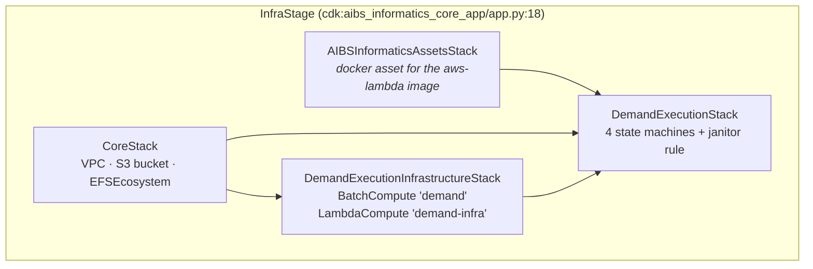

`app.py:18-58`; `CoreStack` `stacks/core.py:10`; `DemandExecutionInfrastructureStack`
`stacks/demand_execution.py:44`; `DemandExecutionStack` `stacks/demand_execution.py:79`.

### 13.2 EFS

Settings on the single file system (`cdk:constructs_/efs/file_system.py:227-238`):

- `throughput_mode = BURSTING` — **hardcoded at `:235`**, not a parameter of `EFSEcosystem`.
  (`EnvBaseFileSystem.__init__` does accept it as a keyword defaulting to `BURSTING`, `:64` — the
  hardcoding is specifically in `EFSEcosystem`'s call.)
- `removal_policy = DESTROY`
- `enable_automatic_backups = False`
- `out_of_infrequent_access_policy = AFTER_1_ACCESS`
- `lifecycle_policy` — parameterized, and `CoreStack` leaves it `None` (`stacks/core.py:35-37`).
  The docstring at `file_system.py:220-224` explains why: **IA-tier bytes do not count toward burst
  credit accrual.**

See [§17.1](#171-efs-bursting-is-the-underlying-problem) for why this matters more than it looks.

### 13.3 Batch compute and queues

`DemandExecutionInfrastructureStack` (`stacks/demand_execution.py:44`) creates two compute
constructs:

| Construct | Class | Environments created |
|---|---|---|
| `demand` | `BatchCompute` | `demand-on-demand`, `demand-spot`, `demand-fargate` |
| `demand-infra` | `LambdaCompute` | `demand-infra-lambda`, `-lambda-small`, `-lambda-medium`, `-lambda-large` |

(`cdk:constructs_/service/compute.py`.) Each gets a compute environment plus a job queue named
`{env_base}-{name}-ce` / `-job-queue` (`cdk:constructs_/batch/types.py:15-26`).

Queue assignment in the reference app (`app.py:47-57`):

| Purpose | Queue |
|---|---|
| scaffolding, create-definition, cleanup (⟨BIL⟩) | `demand-infra-lambda` |
| data sync | `demand-infra-lambda-medium` |
| EFS janitor | `demand-on-demand` (`execution_job_queue`) |
| **the science job** | **not from CDK** — `demand_execution.execution_platform.aws_batch.job_queue_name`, supplied per request (`context_manager.py:829-844`) |

That last row is worth pausing on: **the science job's queue is caller-controlled data, not
infrastructure.** The CDK-supplied `execution_job_queue` is used only by the janitor. See
[§14, D11](#14-design-decisions).

### 13.4 State machines

`DemandExecutionStack` creates the four listed in [§1.4](#14-the-moving-parts-four-state-machines).
All are named `{env_base}-{name}` (`cdk:constructs_/sfn/fragments/base.py:440`).

### 13.5 The scaffolding bucket

The reference app uses `CoreStack`'s single bucket for everything (`app.py:52`,
`stacks/core.py:22-33`). It carries three lifecycle rules — expiry under a scratch prefix, expiry by
scratch tag, and a default storage class. Every ⟨BIL⟩ request/response blob lands at
`scratch/{sfn_execution_name}/{task_uuid}/request.json` and `…/response.json`.

### 13.6 The janitor rule

See [§11.2](#112-the-scheduled-sweep).

---

# Part IV: Why it looks like this

## 14. Design decisions

Each entry: the decision, the forces behind it, what you live with as a result, and where you would
go to change it.

---

**D1 — Handlers run as AWS Batch jobs, not Lambda functions.**

*Forces.* Lambda mounts exactly one EFS file system, and the system needs shared + scratch
simultaneously (and root for infra jobs). Lambda's 15-minute / 10 GB ceiling cannot stage hundreds
of gigabytes. And staging is I/O-bound while science is CPU/GPU-bound — separate jobs let each
phase size its own compute.

*You live with.* ~9 infrastructure Batch jobs per execution ([§1.6](#16-what-one-execution-costs-in-jobs)),
Batch job-start latency added to every logical step, and Batch API traffic several times the job
count.

*Change it at.* `BatchInvokedLambdaFunction` (`cdk:constructs_/sfn/fragments/informatics/batch.py:55`).

---

**D2 — Request and response travel through S3, not Step Functions state.**

*Forces.* Step Functions caps state payloads at 256 KB, and Batch has no synchronous return channel
to SFN. **(The 256 KB motivation is inference — no comment states it — but the mechanism, including
`BatchDataSyncRequest.requests: … | S3Path`, is verified.)**

*You live with.* Two extra S3 operations plus a UUID per step; the scaffolding bucket as a hard
dependency of every handler invocation; and request payloads sitting in S3 *and* logged in full by
Powertools ([§12.4](#124-observability)).

*Change it at.* `cdk:…/informatics/batch.py:123-141`.

---

**D3 — Data lands on EFS rather than streaming from S3.**

*Forces.* Genomics tools need POSIX semantics and random access; many re-read inputs multiple times;
some expect to write into a directory alongside their inputs.

*You live with.* Every run bracketed by a stage-in and stage-out, an EFS bill, a cleanup obligation,
and the burst-credit problem in [§17.1](#171-efs-bursting-is-the-underlying-problem).

*Change it at.* This is the assumption the S3 Files spike questions
([§17.2](#172-in-flight-work)).

---

**D4 — A fresh Batch job definition per ⟨BIL⟩ invocation, deregistered after.**

*Forces.* Job definitions are immutable and carry the container's mounts, volumes, and environment.
Each ⟨BIL⟩ invocation has a different handler and payload location.

*You live with.* Register + submit + deregister on every infrastructure job, and the need for a
catch so a failed submit doesn't leak a definition.

*Change it at.* `SubmitJobFragment` (`cdk:constructs_/sfn/fragments/batch.py:39`).

---

**D5 — The science job's definition is *shared* across executions; only its name is unique.**

`DemandExecution.get_execution_hash(strict)` (`core:models/demand_execution/model.py:30`) is used
twice with different `strict` values (`context_manager.py:804-809`):

| Name | `strict` | Hashed over |
|---|---|---|
| `job_definition_name` | **`False`** | type + image + command **only** |
| `job_name` | `True` | the above + execution id + sanitized params + inputs + outputs |

*Forces.* Deduplicate job-definition registrations across repeated runs of the same
(type, image, command).

*You live with.* Two consequences. (1) Changing only a param value gives a new job *name* but the
same job *definition* — correct, because container overrides carry the environment, but it means the
definition's registered `containerProperties.environment` is whichever execution registered it last.
(2) The strict hash is taken *after* `__post_init__` rewrites params to absolute container paths, so
**the job name is a function of the resolved EFS layout**, not just the caller's input. Replaying an
execution onto a different scratch path produces a different job name.

---

**D6 — `isolate_inputs` defaults to `True`.**

*Forces.* Safety and predictability: a job that mutates its input cannot corrupt a cache other
executions depend on, and per-execution cleanup has an unambiguous scope.

*You live with.* No cross-execution reuse — every execution re-downloads every input. The shared
volume stays empty, which compounds D3's burst-credit problem.

*Change it at.* `ContextManagerConfiguration` (`lambda:handlers/demand/model.py:100`), plumbed
through `DemandExecutionFragment`'s `context_manager_configuration` — which the reference app does
not set.

---

**D7 — The content-addressed cache is keyed on the remote URI, not the content.**

*Forces.* You cannot hash content you have not downloaded yet. The URI is the only key available at
scaffolding time.

*You live with.* Mutating the S3 object does not move the cache path. Freshness rests entirely on
`should_sync`, and the demand path's `size_only=True` skips the ETag check
([§8.2](#82-inputs-and-isolate_inputs)).

---

**D8 — Environment offloaded to a `.demand.env` file on EFS.**

*Forces.* Batch container overrides cap out near 8192 characters; real demand executions exceed it.

*You live with.* The scaffolding job must be able to write into the science job's working
directory — which is precisely why infra jobs mount the **root** access point. Remove that mount and
every execution silently degrades to inline env vars with only a log warning
([§8.5](#85-the-demandenv-offload)).

---

**D9 — The enclosure pattern.**

*Forces.* Step Functions scopes `input_path`/`result_path` to a single state. To scope them around a
multi-state *chain*, a one-branch `Parallel` is the only clean construct.

*You live with.* A rendered graph 5–6× the logical graph, and materially harder console debugging
([§5.5](#55-why-the-console-graph-is-bigger-than-the-diagram)).

*Change it at.* `CommonOperation.enclose_chainable` (`cdk:constructs_/sfn/states/common.py:124`).

---

**D10 — Cleanup is age-based sweeping, not reference counting.**

*Forces.* EFS has no ownership registry, and executions can die at any point without running their
own cleanup ([§12.3](#123-failure-semantics)). Something has to reclaim space unconditionally.

*You live with.* Leaked data survives ≥3 days. The `min_size_bytes_allowed` floor exists because
burst credits accrue with stored bytes — deleting everything degrades throughput — but the reference
app sets it to `0`, disabling that protection. And because the criterion is mtime, **a file merely
read by a container is not protected** ([§11.2](#112-the-scheduled-sweep)).

---

**D11 — The science job's queue is caller-supplied data.**

*Forces.* Different workloads need different compute — GPU, spot, Fargate. The platform cannot know
in advance.

*You live with.* The platform cannot enforce queue policy, and a bad queue name is a runtime failure
rather than a deploy-time one ([§13.3](#133-batch-compute-and-queues)).

---

**D12 — Handlers are typed request/response models over a Lambda-shaped interface.**

*Forces.* Makes handlers unit-testable, runnable either as Lambda or Batch, and self-documenting at
the boundary.

*You live with.* `extra="ignore"` on `PydanticBaseModel` means **fields crossing a boundary that the
receiving model doesn't declare vanish without error.** That is exactly how the
`PrepareBatchDataSyncRequest` fields disappear ([§10.5](#105-the-distributed-path-that-isnt-wired-in)),
and it is the trap any new resolvable field will hit ([§15](#15-sharp-edges-warts-and-latent-bugs)).

---

## 15. Sharp edges, warts, and latent bugs

Ordered roughly by how likely they are to hurt you.

**⚠️ `sync_paths(delete=True)` prunes the destination.** `sync_paths` (`aws-utils:s3.py:692`), when
`delete=True`, lists the *destination* after transferring and deletes anything not in the transferred
set (`:754-769`). It is called with `delete=True` from three places
(`aws-utils:data_sync/operations.py`):

| Call site | Line | Effect |
|---|---|---|
| `sync_local_to_s3` | `:93` | S3 objects under the output prefix that this job did not produce are **deleted** |
| `sync_s3_to_local` (prefix branch) | `:178` | local files under the input destination not in the source are deleted |
| `sync_s3_to_s3` | `:251` | destination objects not in the source are deleted |

The first is the dangerous one: **a demand execution writing to an `output_s3_prefix` that already
holds unrelated objects will delete them.** There is no dry-run and no opt-out short of not using
`DataSyncOperations`. (The `sync_s3_to_local` custom-tmp-dir branch at `:139-167` notably does *not*
pass `delete=True`.)

**⚠️ Constructing `DemandExecutionContextManager` mutates the execution you pass in.**
`__post_init__` (`context_manager.py:187-203`) rewrites input and output param paths — by design.
The surprise is that it also mutates the *caller's* object. Both
`update_demand_execution_parameter_inputs` (`:478`) and `_outputs` (`:535`) start with
`demand_execution = demand_execution.copy()` and their docstrings say "(copied)". But Pydantic v2's
`BaseModel.copy()` defaults to `deep=False`, and `PydanticBaseModel` does not override it — so the
copy shares the *same* `DemandExecutionParameters` instance, and `execution_params.update_params(...)`
at `:531`/`:575` writes through to the original.

```python
c = de.copy()
c.execution_parameters is de.execution_parameters   # True
```

> **Looks like a bug, not a decision.** Harmless today because the handler discards the request
> object after constructing the context manager (`scaffolding.py:108-115`), but any caller that
> constructs a context manager and then reuses its input — including tests — gets silently rewritten
> data. `model_copy(deep=True)` would be the fix. Not fixed.

**⚠️ `sanitize_serialized_params` collapses resolvables to strings.** The Pydantic field serializer
on `params` (`core:models/demand_execution/parameters.py:425-448`) converts any `Resolvable` to
`v.to_str()`, which is action-dependent:

| Type | Action | Serialized form |
|---|---|---|
| `Resolvable` (input) | `LOCALIZE` | `"{remote} @ {local}"` |
| `Uploadable` (output) | `DELOCALIZE` | `"{local} @ {remote}"` |

**Anything not expressible in those two positions is dropped silently.** `ResolvableBase` today has
only `local` and `remote`, plus an `action` injected at serialization (`resolvables.py:198-204`) —
and even `action` does not survive `to_str()`. Direction is recovered on re-parse only because the
`inputs`/`outputs` key lists tell the parser which side is which. **Any new field on a resolvable —
a `mode: copy | mount`, an `include`/`exclude` filter — needs explicit handling here or it will
vanish on the round trip through the scaffolding response.** This is the blocker called out in
OCSDV-453 and the S3 Files spike brief.

**`setup_file_system` is a no-op.** `PrepareDemandScaffoldingHandler.setup_file_system`
(`scaffolding.py:155-162`) computes `container_working_path` and then does nothing — the `mkdir` is
commented out and the variable is `# noqa: F841`'d. The working directory is created as a side effect
of `local_environment_file.parent.mkdir(parents=True, exist_ok=True)` in the env-file branch
(`context_manager.py:784`), otherwise by the data sync creating destination parents, and finally by
the container's own `mkdir -p ${WORKING_DIR}`. Fragile rather than broken: with
`env_file_write_mode=NEVER` **and** no inputs, nothing creates it before the science job — but the
job's first pre-command recovers.

**Two `isolate_inputs` defaults disagree.** Config default `True`; function-parameter default
`False`. See the callout in [§8.2](#82-inputs-and-isolate_inputs).

**A duplicate, unused `create_access_point`.** A module-level function at
`cdk:constructs_/efs/file_system.py:444` mirrors the live method at `:115`. Nothing calls it. Grep
hits will find both.

**Cosmetic validation bug.** The guard at `cdk:…/demand_execution.py:46-52` reads
`if not (shared and scratch) or not (shared or scratch)`. The second clause is unreachable whenever
the first passes, so the check reduces to "both must be provided" — stricter than the error message
describes, harmless given the current call site.

**Smaller edges:**

- **`privileged=True` is hardcoded** for the science job (`context_manager.py:822`), with a
  `# TODO: need to make this configurable`.
- **Input transfer results are discarded twice** — the Map's `result_path` is `DISCARD`
  (`cdk:…/demand_execution.py:226`) and the Parallel's `result_selector` keeps only branch 0 (`:211`).
  Nothing downstream can see how many bytes were staged.
- **`BatchDataSyncHandler` double-counts into a discarded object.** After accumulating into
  `batch_result`, it does
  `if result.bytes_transferred: result.add_bytes_transferred(result.bytes_transferred)`
  (`lambda:handlers/data_sync/operations.py:223-224`) — doubling a per-request `DataSyncResult` that
  is then dropped. Harmless today; leftover code, and a trap if anyone starts returning `result`.
  **Looks like a bug.**
- **`Node` is `@dataclass(order=True)` with a `parent: Node | None` field**
  (`aws-utils:data_sync/file_system.py:36-56`), and `PrepareBatchDataSyncHandler` calls
  `sorted(node_batch)` without a key (`lambda:handlers/data_sync/operations.py:282`). Two nodes with
  equal `path_part` whose ancestor chains differ in depth compare `Node` against `None` and raise
  `TypeError`. Reproducible in isolation; **not reachable through the current call path**, because
  `partition()` returns the root node only when it is the sole partition.
- **`JobParamResolver.find_collisions` is `@cache`d on a classmethod taking `*job_params`**
  (`core:models/demand_execution/job_param_resolver.py:12-18`). The cache is process-global and
  unbounded, holding references to every `JobParam` ever passed. In a long-lived process it grows
  without limit. (An unmerged `bugfix/data-sync-memory-leak` branch exists on `lambda`; whether it
  addresses this was not checked.)
- **`DemandExecutionParameters.validate_parameters` runs twice per refresh** — once in
  `_set_job_params` (`parameters.py:361`), again in `_refresh` (`:370`). Cosmetic.
- **`ParamSetPair` has no consumer.** See [§2.2](#22-the-params-inputs-outputs-split).
- **`EnvFileWriteMode.IF_REQUIRED`'s `confirm_write`** is assigned in both live branches
  (`context_manager.py:747-762`); a future mode added without a branch would raise
  `UnboundLocalError`. Not currently reachable.

## 16. Extension points

| You want to… | Hook |
|---|---|
| add a param kind (new resolvable semantics) | `ResolvableBase` subclass + `get_resolvable_from_value` (`core:models/demand_execution/resolvables.py:118,218`) and the classification branches at `core:…/parameters.py:332-356`. **Read the serialization trap in [§15](#15-sharp-edges-warts-and-latent-bugs) first.** |
| change where inputs/outputs land on EFS | `update_demand_execution_parameter_inputs` / `_outputs` (`lambda:handlers/demand/context_manager.py:478,535`) |
| change the container's environment or command | `generate_batch_job_builder` (`context_manager.py:630`) |
| add or remove a staging / cleanup step | the `pre_execution_*` / `post_execution_*` properties (`context_manager.py:332,372,409`) — they are the sole producers of everything the SFN cleanup chain iterates |
| add a volume role | `DemandFileSystemConfigurations` (`lambda:handlers/demand/model.py:33`) + `construct_batch_efs_configuration` (`scaffolding.py:165`) + the CDK fragment's `file_system_configurations` block (`cdk:…/demand_execution.py:76-125`) |
| change the workflow topology | `DemandExecutionFragment.__init__` (`cdk:constructs_/sfn/fragments/informatics/demand_execution.py:27`) |
| run a new handler as a Batch job | `BatchInvokedLambdaFunction` — supply `handler=` and `payload_path=`; nothing else is needed |
| turn on the distributed / bin-packed sync | swap `DataSyncFragment` for `DistributedDataSyncFragment` at `cdk:…/stacks/demand_execution.py:138` |
| filter what gets transferred | **no hook today.** `sync_paths` accepts `include`/`exclude` regex lists (`aws-utils:s3.py:696-697`) but `DataSyncTask`/`DataSyncRequest` do not carry them. This is what OCSDV-452 adds. |
| add metrics | `MetricsMixins` (`lambda:common/metrics.py:123`) is already on the handler base class and entirely unused on this path. |
| add failure notification | `lambda:handlers/notifications/` exists (SES + SNS notifiers) and is wired to nothing. |

## 17. Pressure on the system, and in-flight work

### 17.1 EFS bursting is the underlying problem

`EFSEcosystem` passes `throughput_mode=BURSTING` literally
(`cdk:constructs_/efs/file_system.py:235`). In bursting mode, **baseline throughput scales with
stored bytes.**

Now stack up the design decisions:

- Scratch filesystems are near-empty **by design** — the whole point of D10's cleanup chain and
  janitor is to keep them that way.
- `isolate_inputs=True` (D6) means the shared cache stays empty too.
- So nothing is accumulating credit-earning bytes, baseline is near zero, and **every execution runs
  on burst credits.**
- Concurrent executions moving 200 GB–1 TB exhaust the credit pool.

This is the problem `aws-lambda#39` / `cdk-lib#61` address by spreading executions across N file
systems — and that the S3 Files spike brief argues is a *symptom* rather than the disease.

Note also the interaction with `lifecycle_policy`: `CoreStack` leaves it `None` deliberately
(`stacks/core.py:35-37`), because IA-tier bytes do not count toward burst credit accrual
(docstring at `file_system.py:220-224`). Moving cold data to IA would make throughput *worse*.

### 17.2 In-flight work

Referenced for orientation. **None of this is current deployed behavior.**

| Item | What it changes |
|---|---|
| **[aws-lambda#39](https://github.com/AllenInstitute/aibs-informatics-aws-lambda/pull/39)** (`feature/demand-execution-multi-efs-v2`) | `DemandFileSystemConfigurations.shared/scratch/tmp` become `list[FileSystemConfiguration]` with a `mode="before"` validator coercing the legacy singular shape. Adds `selection_strategy` (`RANDOM` only) and a `select_file_system` helper. Selection is seeded on the execution id, salted per role (`{execution_id}#scratch`, `#shared`, `#tmp`), so retries land on the same file systems. |
| **[cdk-lib#61](https://github.com/AllenInstitute/aibs-informatics-cdk-lib/pull/61)** | `DemandExecutionFragment` accepts `MountPointConfiguration \| Sequence[…]` per role; internal ⟨BIL⟩ tasks mount **all** candidates so cleanup can reach any of them; reference app deploys 5 `EFSEcosystem`s in prod, 1 elsewhere, with a janitor rule per ecosystem. Wire shape stays byte-identical for single-candidate callers. |
| **OCSDV-452** | include/exclude filtering for data sync. `sync_paths` already accepts the regex lists and `ListDataPathsRequest` already has the fields (`lambda:handlers/data_sync/model.py:86-87`); the gap is threading them through `DataSyncTask`/`DataSyncRequest`. |
| **OCSDV-453** | include/exclude filtering at the demand-execution level, adding fields to `ResolvableBase`. **Blocked on the serialization trap in [§15](#15-sharp-edges-warts-and-latent-bugs).** |
| **S3 Files spike** (in `aibs-informatics-aws-lambda`: branch `spike/s3-files-input-mount-brief`, `docs/developer/s3-files-input-mount-spike.md`) | Evaluates Amazon S3 Files as a replacement **input** path (inputs only; outputs stay on the copy path because S3 Files sync is asynchronous). Gated on Batch S3 Files volumes not supporting the ECS-on-EC2 launch type. Contains the architectural framing for why EFS bursting is the underlying problem. |

The two PRs are sequenced: **aws-lambda#39 merges first**, because the CDK app builds the docker
image from that repo's `main` at synth time.

Where they touch what is documented here:

- [§9.2](#92-volume-roles-and-who-mounts-what) — `file_system_configurations["shared"]` becomes a
  list of candidates rather than a single object.
- [§7](#7-the-handlers) — `PrepareDemandScaffoldingHandler.handle` gains a selection step before
  `construct_batch_efs_configuration`. **`select_file_system` does not exist on `main`** — if you
  are looking for it, it belongs to PR #39.
- [§9.1](#91-one-file-system-four-access-points) — the reference app moves from one `EFSEcosystem`
  to several in prod.

Design context: Jira epic `DT-9913` and the Confluence page *"Enhancing Demand Execution EFS FS
Lifecycle Management"* (space `DAS`, page id `1932525578`). That page describes a **proposed**
design; it is not current behavior and was not a source for this document.

---

# Appendices

## Appendix A: Glossary

**Demand execution** — One containerized job run, described by a `DemandExecution`
(`core:models/demand_execution/model.py:17`): an image, a command, typed parameters, resource
requirements, and an execution platform. "Demand" as in on-demand, ad-hoc — as opposed to a
scheduled pipeline.

**Scaffolding** — The preparation phase, and by extension everything it produces. The scaffolding
handler resolves EFS access points, rewrites every input/output path from a remote URI into a
concrete container path, writes the environment file, and returns `setup_configs` (what to do before
the job) and `cleanup_configs` (what to do after). The **scaffolding bucket** is the S3 bucket used
to pass request/response JSON between Step Functions and Batch containers. The **scaffolding job
queue** runs infrastructure jobs, not science.

**Batch-invoked lambda (⟨BIL⟩)** — A handler written to the Lambda interface but executed as an AWS
Batch job, with request and response passed through S3
(`cdk:constructs_/sfn/fragments/informatics/batch.py:55`). Used when a handler needs an EFS mount,
more memory, or more time than Lambda allows.

**Working directory** — `{scratch_mount}/{execution_id}` — the per-execution scratch space
(`context_manager.py:205-218`). Exposed as `$WORKING_DIR`, and `cd`-ed into before the command runs.
Outputs are written here; with `isolate_inputs=True`, inputs land here too.

**Volume role** — One of `shared`, `scratch`, `tmp` — a logical name for a storage area, decoupled
from which file system or access point backs it. The CDK supplies `file_system_configurations` keyed
by role; the handler consumes the same keys (`lambda:handlers/demand/model.py:33-44`). This
indirection is what the in-flight PRs extend to support multiple file systems per role.

**Access point** — An EFS feature that pins a mount to a subdirectory and a POSIX identity. Four
exist here (`root`, `shared`, `scratch`, `tmp`), all with uid/gid 0 and 0777. Mounting via
`/scratch`'s access point means the container sees that directory as the root of that mount.

**Mount point configuration** — The binding of (file system, access point) → container path. Two
classes share the name: the CDK one (`cdk:constructs_/efs/file_system.py:272`) synthesizes Batch
JSON at deploy time; the runtime one (`aws-utils:efs/mount_point.py:52`) additionally translates
paths between coordinate systems.

**Resolvable** — A parameter with both a `local` and a `remote` value
(`core:models/demand_execution/resolvables.py:118`). A **`Resolvable`** / `DownloadableJobParam` is
an input (remote → local, `LOCALIZE`); an **`Uploadable`** / `UploadableJobParam` is an output
(local → remote, `DELOCALIZE`). Both can be written as strings — `"s3://bucket/key @ /tmp/xxx"`
parses into source and destination (`resolvables.py:42-58`). If an input gives no local destination,
it defaults to `tmp{sha256(remote)[:8]}` (`:94`).

**Job param** — The flattened, environment-variable form of a parameter
(`core:models/demand_execution/job_param.py:59`). Names are upper-snake-cased (`reference-path` →
`REFERENCE_PATH`, `:11-18`), and `${REF}` references between params are resolved before the command
is built.

**Enclosure** — A single-branch `Parallel` state wrapping a chain so `input_path`/`result_path` can
be scoped to it, followed by a `Pass` that unwraps `[0]`
(`cdk:constructs_/sfn/states/common.py:124`). Pervasive, and the reason the rendered graph is much
larger than the logical one.

**Env base** — The environment/stage prefix (e.g. `dev`, `prod`) threaded through every resource name
and used as a tag filter when resolving EFS resources at runtime
(`lambda:handlers/demand/scaffolding.py:192-193`).

**Content-addressed input caching** — Placing an input at `{shared_mount}/{sha256(remote_uri)}` so
identical remotes share one copy (`context_manager.py:525`). Active only when `isolate_inputs=False`;
the default is `True`.

**Janitor / sweep** — The daily, EventBridge-triggered `clean-file-system` state machine. Age-based,
depth-bounded, and entirely independent of any execution.

## Appendix B: Configuration defaults

The settings that most change behavior. Where a value differs between the wire model and the demand
path, the **demand-path value is the one that applies**.

| Setting | Default | Where | Effect |
|---|---|---|---|
| `isolate_inputs` | `True` | `lambda:handlers/demand/model.py:100` | Inputs go to the private working dir; **shared cache unused** |
| `cleanup_inputs` | `True` | `model.py:101` | Input paths deleted after the run |
| `cleanup_working_dir` | `True` | `model.py:102` | Working dir deleted after the run |
| `env_file_write_mode` | `ALWAYS` | `model.py:103` | `.demand.env` always written to EFS by scaffolding |
| `size_only` (demand path) | `True` | `model.py:81` | ETag comparison skipped when deciding to re-sync |
| `force` (demand path) | `False` | `model.py:80` | Existing matching data is not re-transferred |
| `max_concurrency` | `25` | `core:models/data_sync.py:85` | boto3 multipart concurrency **within one file** — never set by the demand path |
| `require_lock` | `True` inputs / `False` outputs | `context_manager.py:360`, `:397` | Input destination locking, up to 6 h wait |
| `retain_source_data` | `True` inputs / `False` outputs | `context_manager.py:359`, `:396` | Outputs removed from EFS after upload |
| `batch_size_bytes_limit` | 75 GiB | `context_manager.py:361`, `:398` | **Ignored** on the current path — see [§10.5](#105-the-distributed-path-that-isnt-wired-in) |
| `privileged` | `True` | `context_manager.py:822` | Science containers run privileged (marked TODO) |
| science job `attempts` | `5` | `lambda:handlers/demand/scaffolding.py:135` | Retry strategy at job-definition registration |
| data-sync job size | 1024 MiB / 1 vCPU | `cdk:…/informatics/data_sync.py:88-89` | Fixed regardless of transfer size |
| `days_since_last_accessed` | `3.0` | `cdk:…/stacks/demand_execution.py:194-197` | Sweep threshold (compares **mtime**) |
| `min_size_bytes_allowed` | `0` | `stacks/demand_execution.py:191` | Sweep size floor **disabled** |
| SM `timeout` | none | `stacks/demand_execution.py:167` | No execution timeout configured |

## Appendix C: Component inventory

| Component | Repo | File | Responsibility |
|---|---|---|---|
| `DemandExecutionFragment` | cdk | `constructs_/sfn/fragments/informatics/demand_execution.py:26` | Builds the demand-execution state machine definition |
| `DemandExecutionStack` | cdk | `aibs_informatics_core_app/stacks/demand_execution.py:79` | Instantiates all four state machines + EventBridge rule |
| `DemandExecutionInfrastructureStack` | cdk | `stacks/demand_execution.py:44` | Batch compute environments and job queues |
| `CoreStack` | cdk | `stacks/core.py:10` | VPC, scaffolding bucket, `EFSEcosystem` |
| `InfraStage` / `app.py` | cdk | `aibs_informatics_core_app/app.py` | Composes Assets → Core → DemandExecutionInfra → DemandExecution |
| `BatchInvokedLambdaFunction` | cdk | `constructs_/sfn/fragments/informatics/batch.py:55` | S3-payload → Batch job → S3-response pattern |
| `SubmitJobFragment` | cdk | `constructs_/sfn/fragments/batch.py:39` | Register → submit → deregister job definition |
| `DataSyncFragment` | cdk | `constructs_/sfn/fragments/informatics/data_sync.py:24` | The `data-sync-v2` state machine |
| `DistributedDataSyncFragment` | cdk | `constructs_/sfn/fragments/informatics/data_sync.py:124` | Parallel sync — **defined, not instantiated** |
| `CleanFileSystemFragment` | cdk | `constructs_/sfn/fragments/informatics/efs.py:243` | Scan → remove sweep state machine |
| `CleanFileSystemTriggerRuleConfig` | cdk | `constructs_/sfn/fragments/informatics/efs.py:206` | EventBridge rule + per-path targets |
| `CommonOperation` | cdk | `constructs_/sfn/states/common.py:9` | `enclose_chainable`, `merge_defaults` |
| `S3Operation` / `BatchOperation` | cdk | `constructs_/sfn/states/s3.py:9`, `states/batch.py:32` | SDK-integration state builders with retry policies |
| `EFSEcosystem` / `MountPointConfiguration` | cdk | `constructs_/efs/file_system.py:189`, `:272` | File system, access points, Batch mount/volume synthesis |
| `PrepareDemandScaffoldingHandler` | lambda | `handlers/demand/scaffolding.py:36` | Resolves volumes, derives paths, builds setup/cleanup configs |
| `DemandExecutionContextManager` | lambda | `handlers/demand/context_manager.py:148` | All path derivation and sync-request generation |
| `generate_batch_job_builder` | lambda | `handlers/demand/context_manager.py:630` | Command, environment, env-file, mounts for the science job |
| `ContextManagerConfiguration` | lambda | `handlers/demand/model.py:84` | `isolate_inputs`, `cleanup_*`, `env_file_write_mode` |
| `CreateDefinitionAndPrepareArgsHandler` | lambda | `handlers/batch/create.py:85` | Registers the science job definition, returns submit args |
| `DataSyncHandler` | lambda | `handlers/data_sync/operations.py:154` | Single sync request → `DataSyncOperations` |
| `PrepareBatchDataSyncHandler` | lambda | `handlers/data_sync/operations.py:237` | Bin-packs a tree into batches — **unreachable from demand path** |
| `OutdatedDataPathScannerHandler` | lambda | `handlers/data_sync/file_system.py:101` | Age + depth + size-floor scan |
| `RemoveDataPathsHandler` | lambda | `handlers/data_sync/file_system.py:168` | Deletes EFS/local paths; skips S3 |
| `LambdaHandler` | lambda | `common/handler.py:38` | Typed request/response handler base |
| `main.handle_cli` | lambda | `main.py:59` | Container entrypoint for Batch-invoked handlers |
| `docker-entrypoint.sh` | lambda | `docker/docker-entrypoint.sh` | Lambda-runtime vs. CLI dispatch |
| `DataSyncOperations` | aws-utils | `data_sync/operations.py:58` | Direction dispatch, locking, mtime refresh |
| `sync_paths` / `should_sync` | aws-utils | `s3.py:692`, `s3.py:1170` | Enumerate + sequentially transfer; `aws s3 sync` semantics |
| `BaseFileSystem` / `Node` | aws-utils | `data_sync/file_system.py:154`, `:37` | Tree model with size/mtime rollup; `partition()` |
| `MountPointConfiguration` (runtime) | aws-utils | `efs/mount_point.py:52` | Container ↔ EFS path translation |
| `detect_mount_points` | aws-utils | `efs/mount_point.py:400` | Batch / Lambda / env-var mount discovery |
| `get_efs_path` / `get_local_path` | aws-utils | `efs/paths.py:53`, `:105` | URI ↔ local path helpers |
| `BatchJobBuilder` / `build_retry_strategy` | aws-utils | `batch.py:297`, `batch.py:144` | Container properties, overrides, retry strategy |
| EFS constants | aws-utils | `constants/efs.py:24-35` | Canonical paths and access point names |
| `DemandExecution` | core | `models/demand_execution/model.py:17` | The root domain model |
| `DemandExecutionParameters` | core | `models/demand_execution/parameters.py:58` | Params, inputs, outputs, command; job-param resolution |
| `Resolvable` / `Uploadable` | core | `models/demand_execution/resolvables.py:255`, `:263` | local ↔ remote pairing |
| `JobParam` / `DownloadableJobParam` | core | `models/demand_execution/job_param.py:59`, `:137` | Env-name normalization, `${REF}` resolution |
| `DataSyncRequest` / `PrepareBatchDataSyncRequest` | core | `models/data_sync.py:95`, `:193` | Sync task + config models |
| `EFSPath` | core | `models/aws/efs.py:83` | The `fs-xxx:/path` URI type |

## Appendix D: Verification, inference, and gaps

### Commits this was checked against

| Repo | Branch | Commit |
|---|---|---|
| `aibs-informatics-core` | `main` | `09b7e3d` |
| `aibs-informatics-aws-utils` | `main` | `23f1637` |
| `aibs-informatics-aws-lambda` | `main` | `90ab548` |
| `aibs-informatics-cdk-lib` | `main` | `f7831ee` |

> **On `cdk:` line numbers.** They are against this repo's `main` at `f7831ee`, verified by direct
> read. Note that `feature/ecr-mirroring` shifts them by one to a few lines: its changes to
> `demand_execution.py`, `data_sync.py`, and `efs.py` are confined to how a Docker image URI is
> resolved (`resolve_image_uri` / `DockerAssetLike`) and do not alter topology, but they do move
> code. If you are reading on that branch, expect small offsets.

> **These citations are a dated snapshot, not a live index.** There are 133 of them across four
> repos, and nothing in any repo's CI will notice when they drift — a change to `aws-utils/s3.py`
> will not put this file in front of a reviewer. Trust the symbol names over the line numbers, and
> re-verify against the commit table above before relying on any specific `:line`.

### Verified by running code, not just reading it

- The param → environment variable translation in [§1.3](#13-a-worked-example).
- The shallow-copy mutation in [§15](#15-sharp-edges-warts-and-latent-bugs).
- `isolate_inputs` destination paths, against `lambda:test/.../test_context_manager.py:663,833-834`.

### Claims deliberately **not** made

- **Actual deployed environments.** [§13](#13-the-infrastructure) describes what
  `aibs_informatics_core_app` *synthesizes*. Whether production runs that app, with those queue
  assignments and that single EFS file system, was not verified — no AWS calls were made.
- **`ContainerOverrides` size limit.** The 8192-character figure comes from the code's own warning
  text and threshold (`context_manager.py:742,750`). Not checked against current AWS Batch quotas.
- **Step Functions 256 KB state limit** as the motivation for the S3 payload offload: the standard
  quota matches the code's shape, but no comment states it. Treat the *motivation* as inference; the
  *mechanism* is verified.
- **Which execution types run with `isolate_inputs=False`.** `DemandExecutionFragment` accepts
  `context_manager_configuration` (`cdk:…/demand_execution.py:43,132-133`) and the reference app
  passes none, so the reference deployment always uses defaults. Whether any real caller overrides
  it is unknown.
- **Non-reference consumers.** `DemandExecutionFragment` is a library construct; stacks outside these
  four repos may wire it differently — different mount paths, different queues. Only
  `aibs_informatics_core_app` was examined.
- **`build/` and `.venv/` copies.** `aibs-informatics-cdk-lib/build/lib/…` holds a stale copy of
  these modules. All citations are to `src/`.

### Open questions

1. **Whether `DistributedDataSyncFragment` is used in any other deployment.** Unreferenced in this
   workspace, but these are libraries — a downstream app could instantiate it. The reference app
   does not.
2. **Effective `Map` concurrency** for input/output transfers. No `max_concurrency` is set
   (`cdk:…/demand_execution.py:215`, `:262`, `:285`). The practical limit is the Batch queue's
   compute capacity, defined in `BatchCompute`/`LambdaCompute` — not traced.
3. **Actual queue sizing and instance types.** `DemandExecutionInfrastructureStack` delegates to
   `BatchCompute` and `LambdaCompute`; their internals were not read.
4. **Whether the redundant `rootDirectory: "/"` alongside `authorizationConfig`
   (`context_manager.py:105-114`)** is accepted or ignored by the Batch API. The CDK-side builder
   omits it in that case.
5. **Real-world behavior of the content-addressed cache under mutation.** The `size_only=True`
   staleness analysis in [§8.2](#82-inputs-and-isolate_inputs) is inferred from `should_sync`, not
   observed.
6. **How `DemandExecution` payloads reach the state machine.** The fragment's first `Pass` treats the
   entire input `$` as the demand execution (`cdk:…/demand_execution.py:128`), but nothing in these
   four repos *starts* an execution. The caller is external.
7. **Whether metrics or notifications exist at a layer outside these repos** — e.g. an account-level
   EventBridge rule on Step Functions state changes. Nothing in-repo wires them.

### If you publish this to Confluence

- **Checkboxes do not render** through the Atlassian markdown path — neither `- [ ] ` nor `[ ] `.
  This document uses plain bullets throughout, so no conversion is needed.
- **Prefer a standard page over a Live Doc.** On a Live Doc, a REST write can be silently reconciled
  away by the collaborative backend. If you write to one anyway, **re-read the page afterward** to
  confirm the content persisted.
- Confluence renders Mermaid only via a macro or app. If unavailable, the diagrams need exporting as
  images — except the main flow, which has an ASCII fallback at
  [§5.3](#53-main-flow-ascii-fallback).
